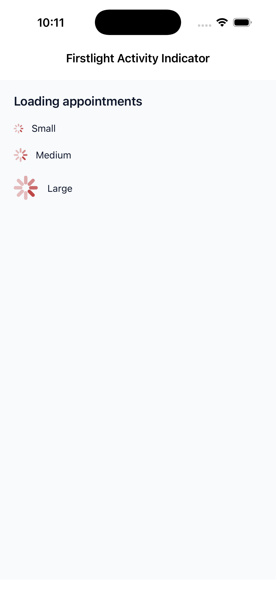
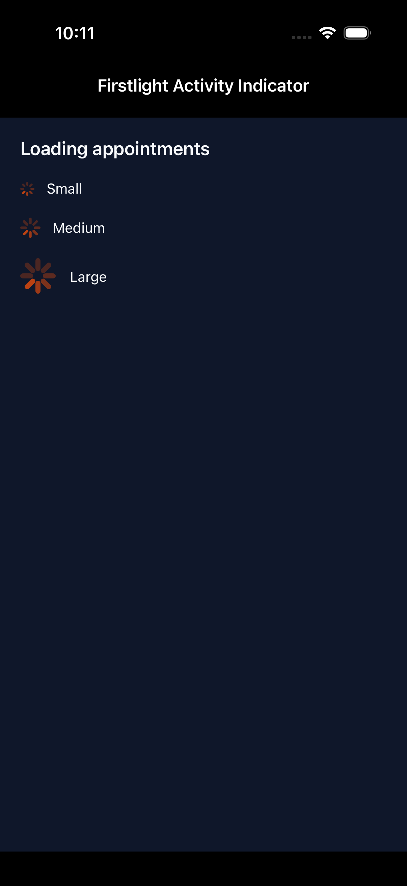
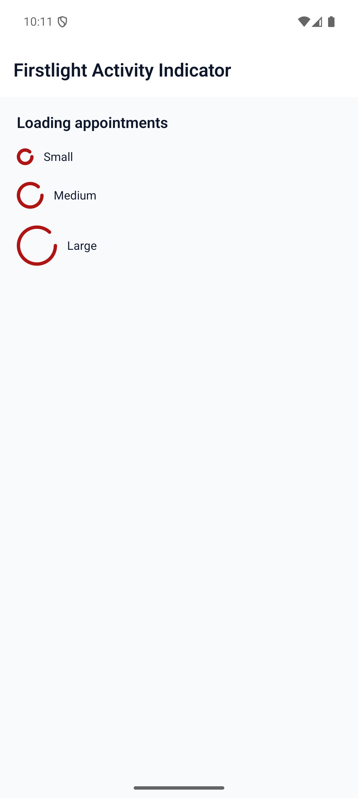
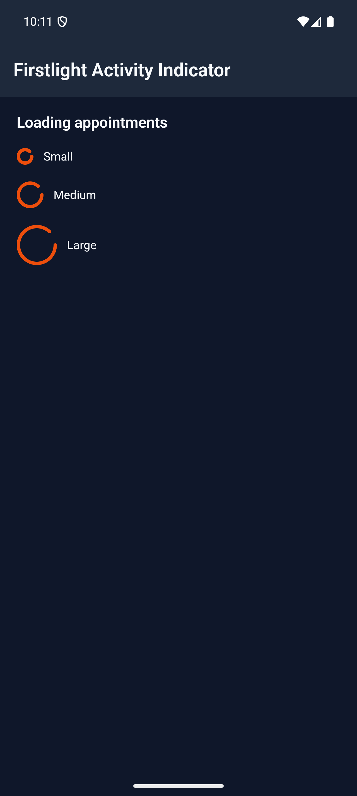

# Activity Indicator

Activity Indicator communicates that work is active when no meaningful
completion value is available. It renders a circular, indeterminate native
indicator with no visible text inside the component.

## Complete example

Render the component only while the work is active:

```blade
@if ($loading)
    <firstlight:activity-indicator
        size="md"
        a11y-label="Loading appointments"
    />
@endif
```

Presence is the activity state. Removing the element stops the presentation;
the component has no separate `loading`, `active`, or `visible` prop. Use the
same conditional server state that decides whether the work is active rather
than attaching `wire:loading` to this native element.

## Props

| API | Accepted type | Purpose |
| --- | --- | --- |
| `size` | `sm`, `md`, or `lg` | Semantic native size. Defaults to `md`. |
| `a11y-label` | non-empty `string` | Required accessible name describing the active work. The `a11yLabel` authoring alias is also accepted. |
| `class` | `string` | External EDGE layout utilities. |

Size is semantic, not a shared point or dp measurement. Firstlight maps each
value to an appropriate native size on each platform.

Colour comes from the host NativePHP theme's primary token. Activity Indicator
has no `color`, `tone`, or `variant` escape prop.

## Visible text

`a11y-label` is not displayed. Compose separate visible text when sighted users
also need context:

```blade
<native:row class="items-center gap-3">
    <firstlight:activity-indicator
        size="sm"
        a11y-label="Refreshing appointments"
    />

    <native:text>Refreshing appointments…</native:text>
</native:row>
```

The visible text and accessible name may use the same wording, but they remain
separate responsibilities. Activity Indicator is self-closing and has no label
or content slot.

## Events and state timing

Activity Indicator has no event, callback, or model binding. PHP publishes the
element while work is active, and the native control owns its indeterminate
animation without timer callbacks or animation frames crossing the bridge.

On a new mount, assistive technology receives one polite announcement using
the authored `a11y-label`. Ordinary server reconciliation, size changes, label
changes, and body recomputation do not repeat that announcement. Removing the
element and later adding a new mounted element begins a new appearance.

## Disabled, loading, and failure behaviour

The component is display-only, so disabled, selected, pressed, error, helper,
required, and validation states do not apply. Its presence already means
loading; a second loading flag would create contradictory state.

A missing, empty, whitespace-only, or non-string `a11y-label` throws an
`InvalidArgumentException`. Unsupported sizes and content, state, event,
styling, hint, value, or synchronization attributes also fail before the
Element Tree is published. Firstlight does not silently coerce `small`,
`large`, `xs`, `xl`, integers, booleans, arrays, or `null` into a size.

## Accessibility

The required label names the work rather than the generic visual, for example
`Loading appointments` instead of `Spinner`. The indicator has no accessibility
hint, percentage, click action, or interactive role. The polite appearance
announcement does not move screen-reader focus.

VoiceOver receives the SwiftUI control's accessible label plus one guarded
appearance announcement. TalkBack receives the label as its content
description and the indicator as a polite live region. Both retain native
contrast, right-to-left behaviour, Increased Contrast, and Reduced Motion or
system animation policy.

## Platform behaviour

iOS uses a genuine circular SwiftUI `ProgressView`, native `ControlSize`
mapping, and the host theme's primary colour. Android uses Material 3
`CircularProgressIndicator` at Material-appropriate `20.dp`, `32.dp`, and
`48.dp` dimensions for `sm`, `md`, and `lg`.

The platforms retain their own geometry and animation. The shared guarantee is
purpose, semantic size order, theme intent, accessibility, and lifecycle—not
pixel parity.

## Activity Indicator or Progress?

Use Activity Indicator for circular, indeterminate activity whose completion
cannot be measured. Use [Progress](progress.md) when you have a fraction from
`0.0` through `1.0`, or when a linear progress treatment better communicates
the task. Neither component starts or controls the underlying work.

## Compatibility

Activity Indicator supports the versions listed in the current [compatibility
reference](../reference/compatibility.md). The host application must compile
both Firstlight-owned native renderers declared by the package manifest.

## Screenshots

| Platform | Light | Dark |
| --- | --- | --- |
| iOS |  |  |
| Android |  |  |
