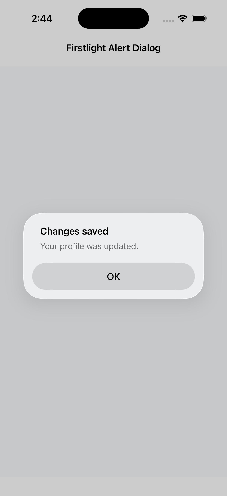
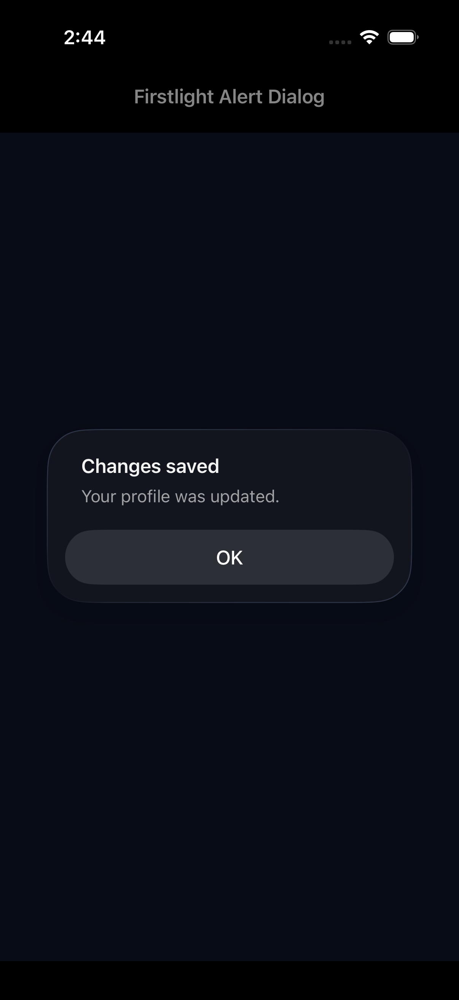
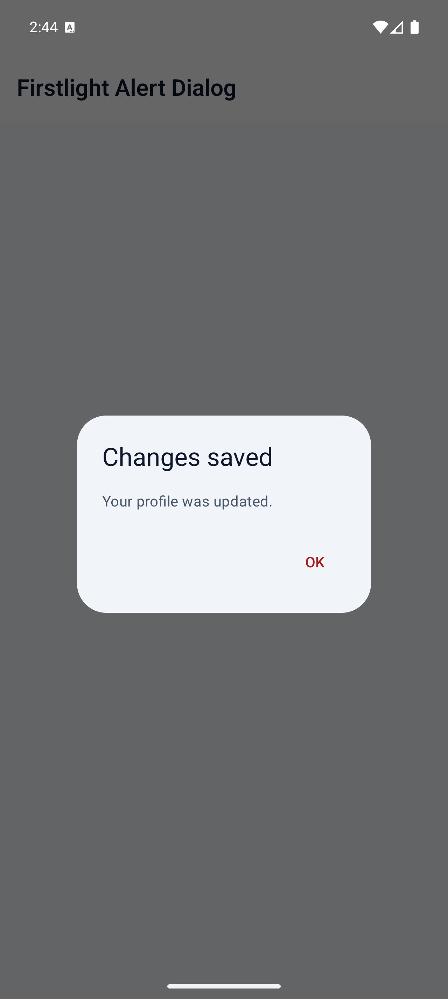
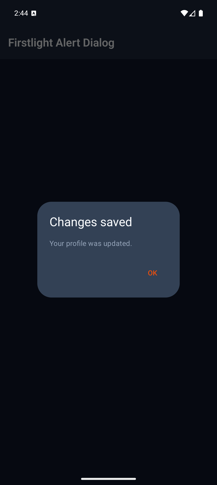

# Alert Dialog

Alert Dialog tells the user one fact they must acknowledge. It uses the
platform's native one-button alert, not a custom full-screen overlay.

Use [Confirmation Dialog](confirmation-dialog.md) when the user must choose
between confirm and cancel. Use [Transient Feedback](transient-feedback.md)
for a non-blocking toast. Use [Modal](modal.md) only when the surface needs
authored child content.

```blade
<firstlight:alert-dialog
    :visible="$showingSaved"
    title="Changes saved"
    message="Your profile was updated."
    action-label="OK"
    @dismiss="acknowledgeSaved"
/>
```

The dismiss handler should set `$showingSaved` to `false`. The same handler
runs for the action button, back, and outside dismissal.

## Props and events

- `visible`: server-controlled presentation request; defaults to `false`.
- `title`: required visible heading and accessible dialog name.
- `message`: required explanation.
- `action-label`: acknowledgement action text; defaults to the package chrome
  string `OK`. The `actionLabel` alias is accepted. See
  [Localize chrome](../how-to/localize.md).
- `@dismiss`: required callback for the action, back, or outside dismissal.
- `class`: external EDGE layout only.

The component always presents one action. It does not support `@press`, a
cancel action, tones, icons, loading or disabled states, `native:model`,
authored children, or an undismissable mode.

## Behavior and accessibility

One user acknowledgement produces one `@dismiss` callback. Programmatic
closure produces none. After the user dismisses the dialog, copy-only
publications do not reopen it; a later server transition from `false` to
`true` presents it again.

iOS uses SwiftUI `alert`. Android uses Material 3 `AlertDialog` with a single
confirm button. Native chrome owns modal focus, action placement, Dynamic Type
or font scaling, dark appearance, contrast, reduced motion, and right-to-left
behavior. The title is the accessible name.

## Screenshots

| Platform | Light | Dark |
| --- | --- | --- |
| iOS |  |  |
| Android |  |  |
