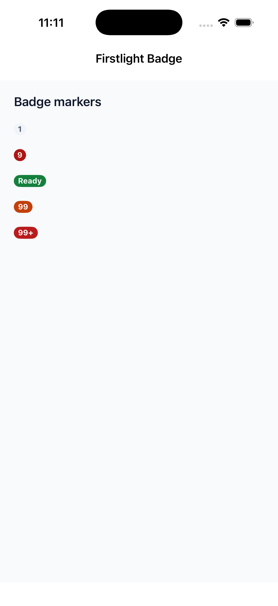
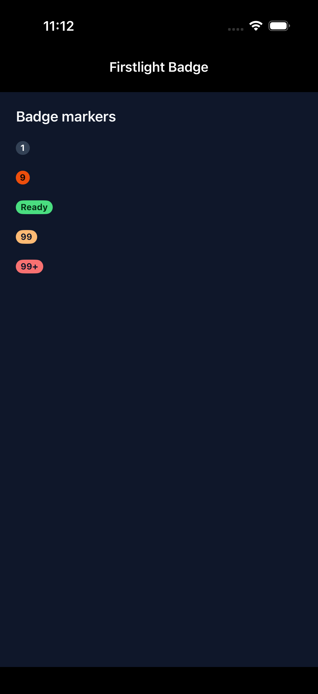
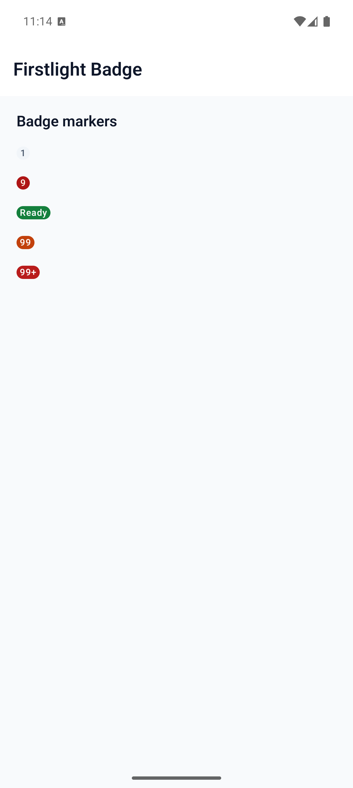
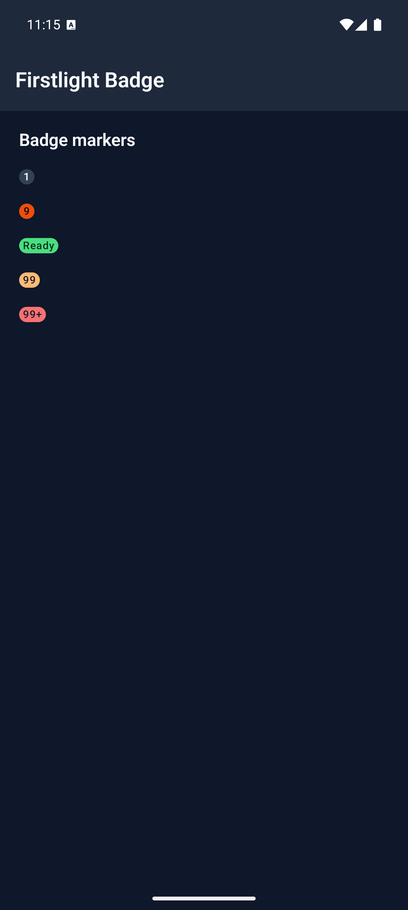

# Badge

Badge presents a compact display-only count or short marker. Use Status Label for longer status text and an interactive control when the interface must respond to a press.

## Complete examples

```blade
<firstlight:badge
    :count="$unreadCount"
    tone="danger"
    a11y-label="{{ $unreadCount }} unread messages"
    a11y-hint="Open the inbox to review them"
/>

<firstlight:badge label="New" tone="info" />
```

The same authored tags render on iOS and Android.

## Props

| API | Accepted type | Purpose |
| --- | --- | --- |
| `count` | non-negative `int` | Numeric marker. Counts above 99 display as `99+`; zero is hidden. Exactly one of `count` or `label` is required. |
| `label` | non-empty `string` | Short visible marker text. Exactly one of `count` or `label` is required. |
| `tone` | `neutral`, `info`, `success`, `warning`, or `danger` | Semantic colour intent. Defaults to `neutral`. |
| `a11y-label` | `string` | Accessible name. Required and non-empty for count badges; replaces the visible label for text badges. |
| `a11y-hint` | `string` | Supplementary VoiceOver or TalkBack context. |
| `class` | `string` | External EDGE layout utilities. |

## Events and values

Badge has no model binding or events. A later server publication may replace its count, label, tone, or accessibility metadata without producing a callback.

Do not use `native:model`, `@change`, `@press`, `value`, `disabled`, `loading`, `helper`, `error`, `required`, icons, variants, or colour escape props. Firstlight rejects those attributes instead of silently adding interactive or field semantics.

## Count behaviour

Firstlight formats the visible count once in PHP so both platforms publish and render the same label:

- `0` publishes an empty display label and renders no badge.
- `1` through `99` display the complete decimal count.
- `100` and above display `99+`.

A count badge always requires a contextual `a11y-label`; the formatted visual text alone is not a useful accessible name. A text badge uses its visible label as the accessible name unless `a11y-label` replaces it.

## State timing

Badge renders the latest published Element Tree metadata. It keeps no native selection, editing buffer, pending proposal, or animation state. Programmatic updates reconcile by the element's stable node ID and emit nothing.

## Accessibility

Both platforms expose static-text semantics without button, selected, disabled, or live-region traits. Hidden zero badges expose no element. Text follows Dynamic Type on iOS and system font scaling on Android.

Semantic theme colours are checked at render time. When a customised foreground and background are below 4.5:1 contrast, Firstlight uses whichever of black or white provides the stronger contrast.

## Validation and failure behaviour

Missing both display sources, providing both, a negative or non-integer count, an empty label, or an unsupported tone throws an `InvalidArgumentException` before publication. Malformed tone data that unexpectedly reaches a native renderer falls back defensively to `neutral` rather than crashing the host.

## Platform behaviour

iOS composes SwiftUI `Text` in a native capsule-style marker. Android composes Material 3 `Badge`. Both inherit NativePHP semantic theme tokens while retaining platform-native typography, scaling, colour-scheme, and layout behaviour.

## Compatibility

Badge supports the versions listed in the current [compatibility reference](../reference/compatibility.md) and requires both native renderers to be compiled into the host application.

## Screenshots

| Platform | Light | Dark |
| --- | --- | --- |
| iOS |  |  |
| Android |  |  |
