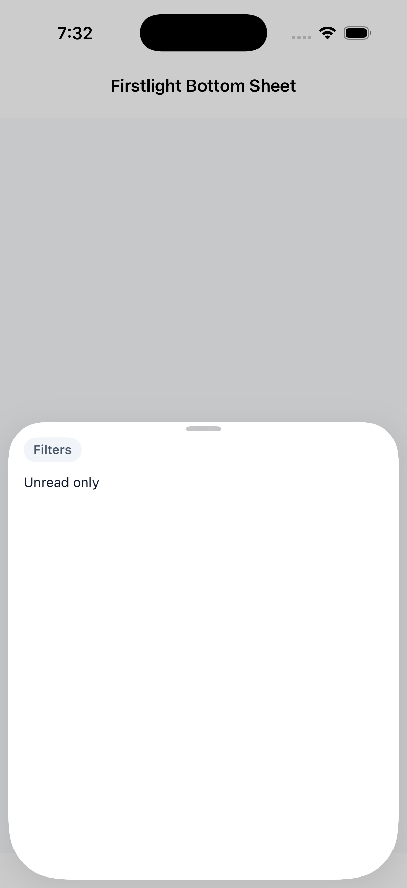
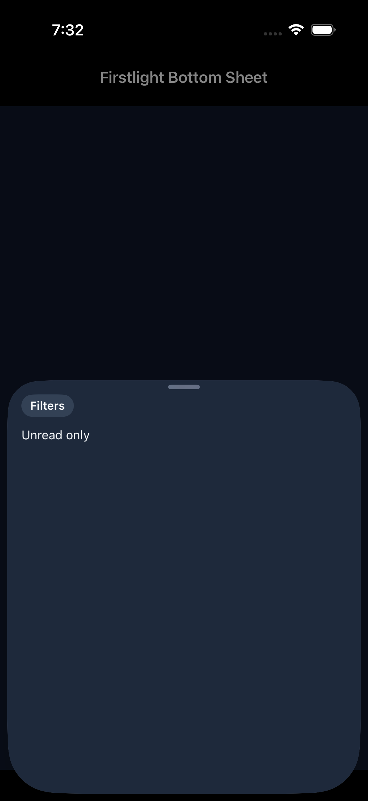
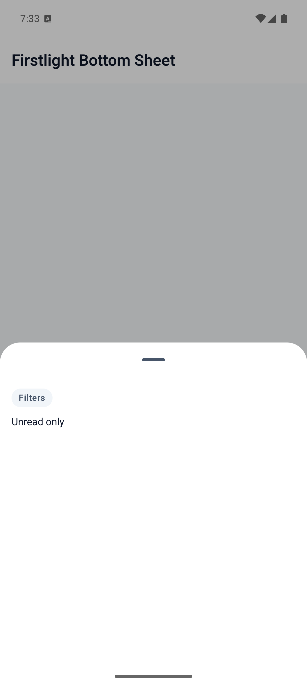
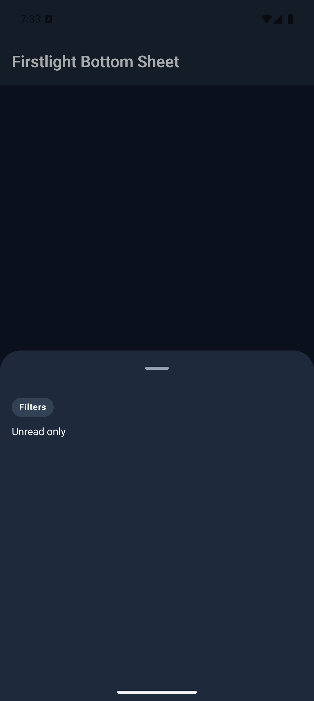

# Bottom Sheet

Bottom Sheet presents authored content in a panel that slides up from the
bottom of the screen. PHP owns whether the sheet is requested; each platform
owns sheet chrome, drag to dismiss, and height stops.

Use [Modal](modal.md) for a full-screen overlay. Use
[Alert Dialog](alert-dialog.md) for a single acknowledgement. Use
[Confirmation Dialog](confirmation-dialog.md) for a confirm/cancel
decision.

## Complete example

```blade
<firstlight:bottom-sheet
    :visible="$showingFilters"
    a11y-label="Filters"
    @dismiss="closeFilters"
>
    <firstlight:status-label label="Filters" />
</firstlight:bottom-sheet>
```

The dismiss handler should set `$showingFilters` to `false`.

## Props

| API | Accepted type | Purpose |
| --- | --- | --- |
| `visible` | `bool` | Server-controlled presentation request. Defaults to closed. |
| `a11y-label` | non-empty `string` | Accessible name for the sheet. |
| `a11y-hint` | non-empty `string` | Supplementary screen-reader guidance. |
| `class` | `string` | External EDGE layout utilities. |

## Events

`@dismiss` is required. It runs when the user drags the sheet down, taps
outside, or uses system back. Set the bound visibility property to `false` in
that handler.

There is no overlay `@press`, `native:model`, `dismissible`, or shared
`detents` API. Height stops stay native so iOS detents and Material sheet
stops are not forced into one geometry.

## Platform expression

Bottom Sheet is an adapter over Mobile UI `bottom_sheet`. iOS uses SwiftUI
`.sheet` with a drag indicator. Android uses Material 3 `ModalBottomSheet`.
Theme tokens own surface and scrim colour.

## Screenshots

| Platform | Light | Dark |
| --- | --- | --- |
| iOS |  |  |
| Android |  |  |
