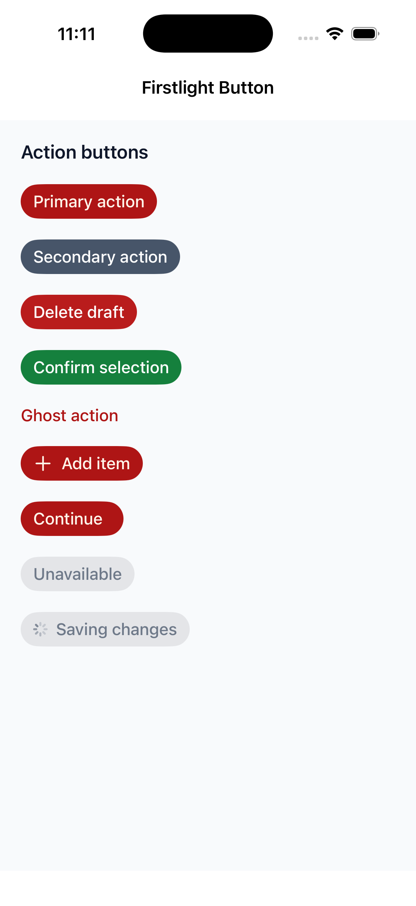
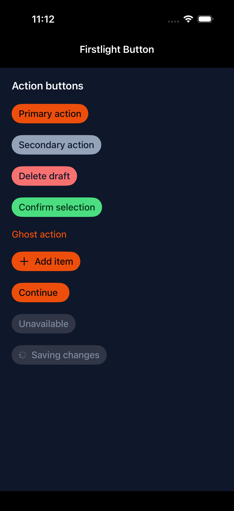
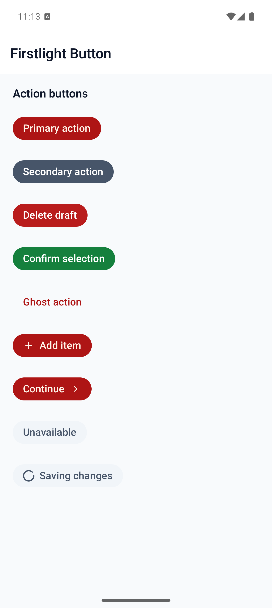
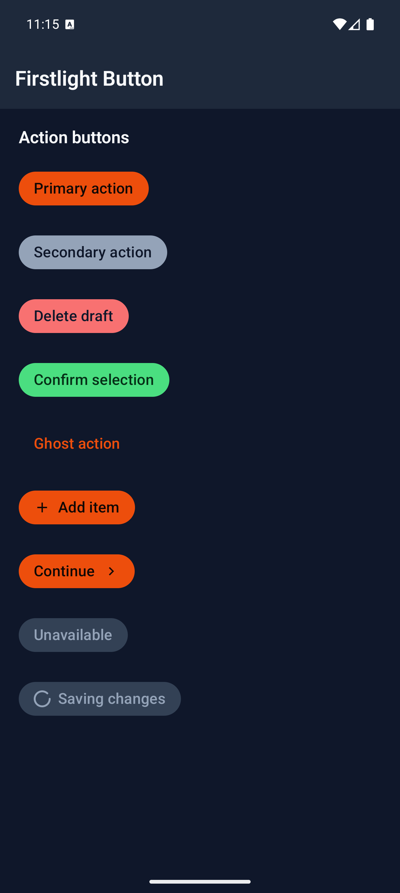

# Button

Button performs one immediate, labelled action. Firstlight includes it because a coherent UI library is expected to provide its foundational action control under the same `<firstlight:...>` namespace and semantic conventions as the rest of the catalogue.

The current component deliberately wraps the adequate `nativephp/mobile-ui` Button. It keeps a stable Firstlight API while reusing the official SwiftUI and Material 3 renderers instead of maintaining duplicate native code.

## Complete example

```blade
<firstlight:button
    variant="primary"
    size="md"
    icon="check"
    :loading="$saving"
    :disabled="! $canSave"
    a11y-hint="Saves the current form"
    @press="save"
>
    Save changes
</firstlight:button>
```

The same authored tag works on iOS and Android. A self-closing form with a `label` prop is also accepted, but the text slot is preferred for ordinary Blade markup.

## Props

| API | Accepted type | Purpose |
| --- | --- | --- |
| Text slot / `label` | non-empty `string` | Visible button text. Required. |
| `variant` | `primary`, `secondary`, `destructive`, `success`, or `ghost` | Semantic action intent. Defaults to `primary`. |
| `size` | `sm`, `md`, or `lg` | Native control size. Defaults to `md`. |
| `disabled` | `bool` | Prevents interaction and exposes native disabled state. Defaults to `false`. |
| `loading` | `bool` | Shows native progress presentation and prevents interaction. Defaults to `false`. |
| `icon` | `string` | Optional leading cross-platform icon name. |
| `icon-trailing` | `string` | Optional trailing cross-platform icon name. |
| `a11y-label` | `string` | Replaces the visible text as the accessible name. |
| `a11y-hint` | `string` | Adds supplementary VoiceOver or TalkBack context. |
| `class` | `string` | External EDGE layout utilities. |

Button always has visible text. Use Icon Button for an icon-only action.

## Events and values

`@press` invokes the named PHP action once for a native user press. Button has no bound value, options, `native:model`, or `@change` event.

## State timing

A press emits immediately. The native button keeps only transient platform press feedback; PHP owns the action result and publishes any subsequent `loading`, `disabled`, label, or layout state. Programmatic publications do not emit a press.

## Disabled, loading, and failure behaviour

Disabled and loading buttons do not emit. Loading replaces the ordinary content with native progress presentation while retaining the action's accessible context.

A missing, `null`, empty, or whitespace-only label throws an `InvalidArgumentException`. `disabled` and `loading` require real booleans. Unsupported variants or sizes also throw. Attached menus, custom typography, Liquid Glass classes, navigation directives, field props or bindings, long press, double tap, press-down, and press-up callbacks are outside this component's contract and fail rather than silently widening the API.

## Accessibility

The visible text is the accessible name by default. `a11y-label` replaces it, and `a11y-hint` adds context. The native renderers expose the button role, disabled state, press interaction, Dynamic Type or system font scaling, platform focus behaviour, and platform target sizing. Android also announces loading as a state description.

## Platform behaviour

iOS uses the official Mobile UI SwiftUI `Button` renderer with native button styles, control sizes, progress presentation, icon layout, VoiceOver metadata, and semantic theme tokens. Android uses the official Mobile UI Material 3 `Button`, `FilledTonalButton`, or `TextButton` renderer with native state layers, progress presentation, icon layout, TalkBack metadata, and semantic theme tokens.

The shared variants express the same intent without forcing pixel parity. `destructive` is currently a semantic visual variant; Firstlight does not expose an Apple-only action-role prop.

## Why an adapter?

The official Mobile UI primitive already satisfies this contract. Firstlight therefore wraps it for catalogue and namespace consistency instead of rebuilding it. The public type remains `firstlight.button`, so Firstlight can move to package-owned renderers later without changing consumer markup if a durable cross-platform requirement genuinely outgrows Mobile UI. Generally useful renderer improvements should be contributed upstream where practical.

## Compatibility

Button supports the versions listed in the current [compatibility reference](../reference/compatibility.md). The host application must compile the installed `nativephp/mobile-ui` iOS and Android renderers that the Firstlight adapter declares.

## Screenshots

| Platform | Light | Dark |
| --- | --- | --- |
| iOS |  |  |
| Android |  |  |
