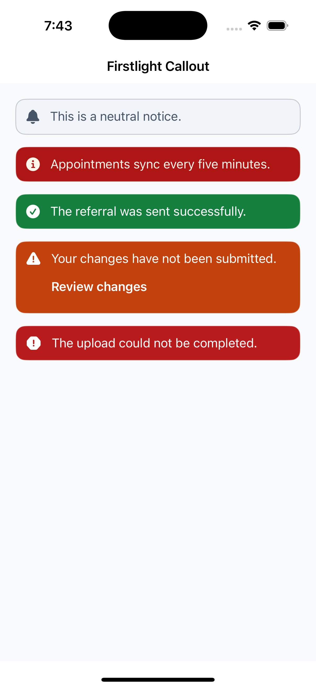
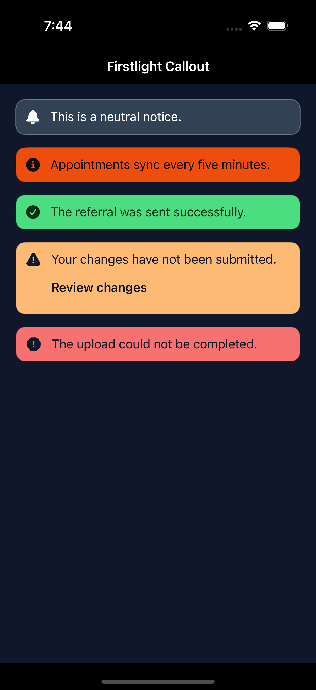
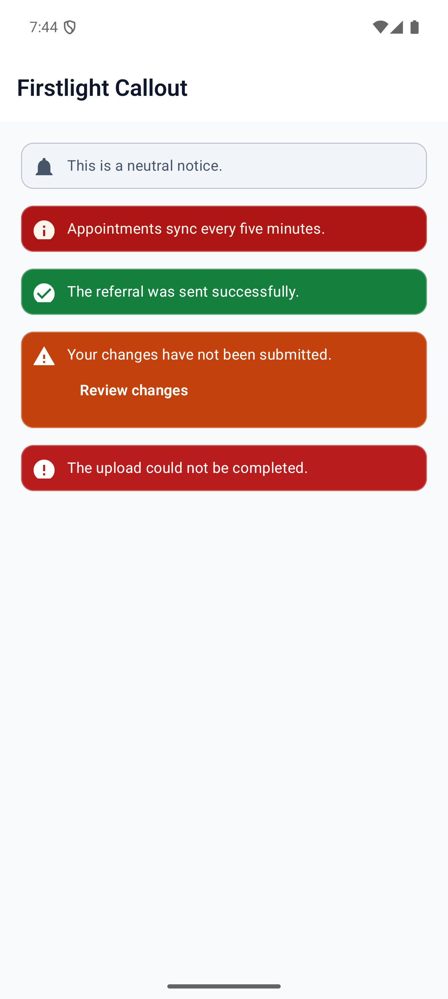
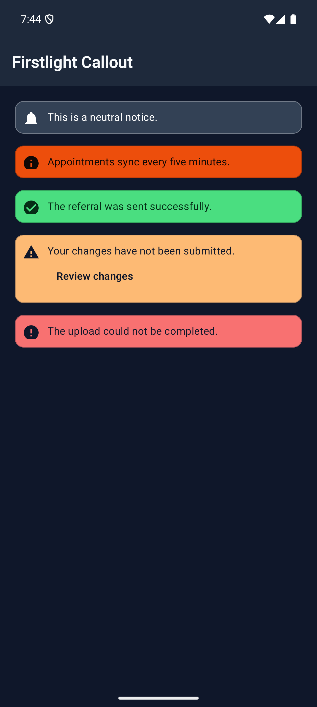

# Callout

Callout keeps an important semantic message visible in the page layout. It may include one labelled action, but it does not dismiss itself, expire, or enter a feedback queue.

## Complete example

```blade
<firstlight:callout
    message="Your changes have not been submitted."
    tone="warning"
    action-label="Review changes"
    @press="reviewChanges"
/>
```

The same tag renders as an idiomatic rounded SwiftUI message surface on iOS and a Material 3 surface on Android.

## Props

| API | Accepted type | Purpose |
| --- | --- | --- |
| `message` | non-empty `string` | Required visible message. |
| `tone` | `neutral`, `info`, `success`, `warning`, or `danger` | Semantic intent. Defaults to `info`. |
| `action-label` | non-empty `string` | Optional visible action label. Requires `@press`. The `actionLabel` alias is also accepted. |
| `a11y-label` | `string` | Replaces the generated accessible message. |
| `a11y-hint` | `string` | Adds supplementary context to the accessible message. |
| `class` | `string` | External EDGE layout utilities. |

Callout owns its semantic symbol. There are no `icon`, `icon-ios`, or `icon-android` props because changing that affordance could contradict the tone.

## Events and state timing

`@press` is the one optional standard action event. It must be paired with `action-label` and fires once for each completed native button activation.

Callout has no value or model. PHP controls whether it is present and may publish new message, tone, action, or accessibility metadata. Native reconciliation updates the existing stable node without emitting an event.

## Persistence and dismissal

Callout remains in its authored position until the next Element Tree omits it. It has no timeout, close button, swipe gesture, `dismissible` prop, or dismissal event. Use Transient Feedback for brief queued outcomes and Confirmation Dialog when work must pause for a decision.

## Disabled, loading, and error behaviour

Disabled and loading states do not apply. Render or omit the action according to application state, and publish the semantic tone that describes the message. Although `danger` can communicate an error outcome, Callout is not a field-validation control and does not accept `error`, `helper`, or `required`.

## Accessibility

Tone is conveyed by a distinct native symbol and by the generated accessible name, such as `Warning: Your changes have not been submitted.` The icon is decorative to VoiceOver and TalkBack. `a11y-label` replaces the generated name, while `a11y-hint` adds context.

The optional action is a separate native button whose visible text is its accessible name. Its target is at least 44 points on iOS and 48 dp on Android. Message text wraps and surfaces grow for Dynamic Type, Android font scaling, and long localisation. Callout is not a live region; persistent content does not automatically interrupt the screen reader.

## Validation and failure behaviour

A missing, empty, whitespace-only, or non-string `message` throws an `InvalidArgumentException`. Unsupported or non-string tones fail and list the accepted values. `action-label` without `@press`, `@press` without `action-label`, and blank action labels fail before publication.

Firstlight also rejects model, change, dismissal, title, icon, disabled, loading, validation, navigation, long-press, and visual escape attributes instead of silently inventing behavior. If malformed data reaches a native renderer, it falls back to `info` and suppresses an incomplete action without crashing.

## Platform behaviour

iOS composes SwiftUI `Image`, `Text`, and `Button` with platform typography, a continuous rounded rectangle, VoiceOver containment, and native Dynamic Type. Android composes a Material 3 `Surface`, icon, text, and `TextButton` with Material typography and TalkBack semantics.

Both inherit NativePHP semantic theme tokens and preserve native dark mode, increased contrast, focus, activation feedback, and right-to-left layout rather than forcing pixel parity.

## Compatibility

Callout supports the versions listed in the current [compatibility reference](../reference/compatibility.md). The host application must compile both Firstlight-owned native renderers declared by the package manifest.

## Screenshots

These development screenshots were captured from the dedicated `/captures/callout` showcase route on an iPhone 16 Pro Simulator running iOS 18.6 and the `Pixel_9_Pro` Android emulator.

| Platform | Light | Dark |
| --- | --- | --- |
| iOS |  |  |
| Android |  |  |
