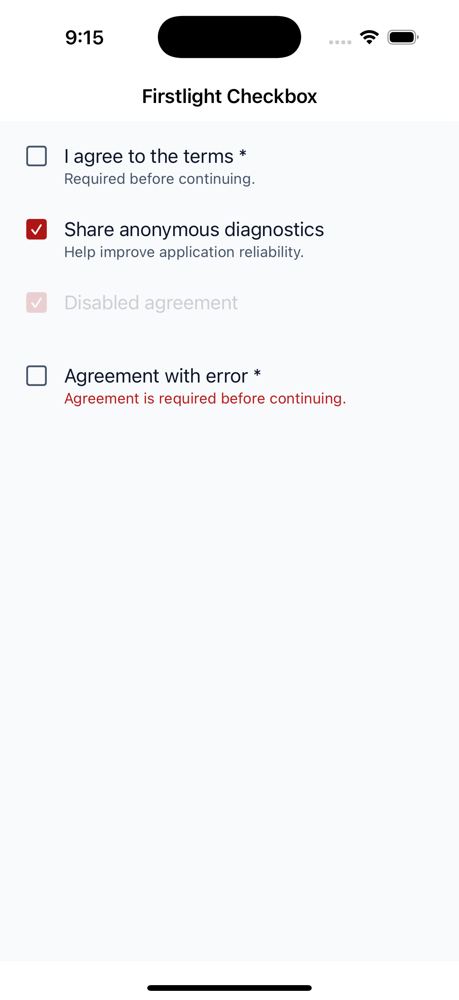
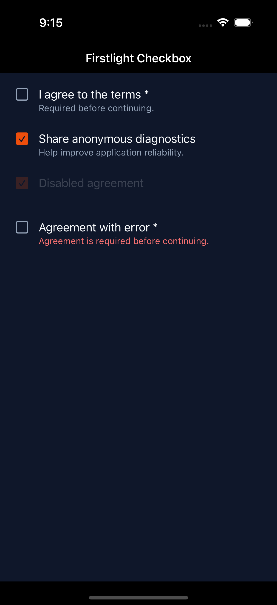
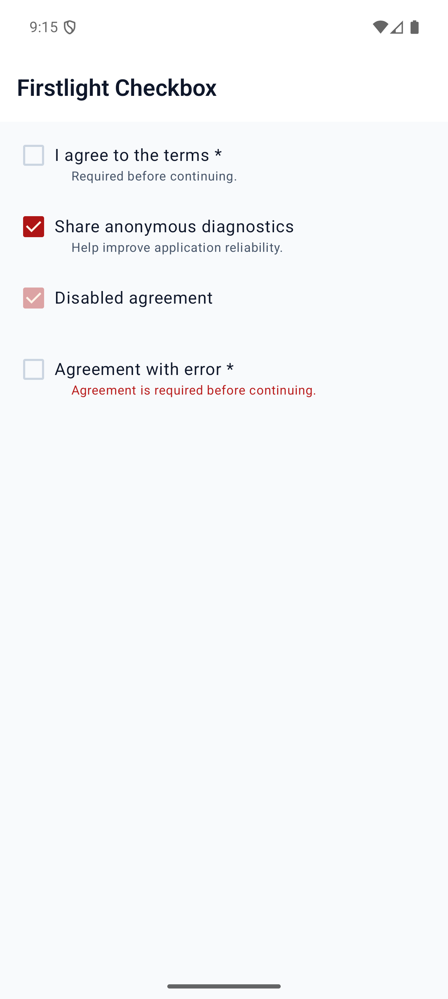
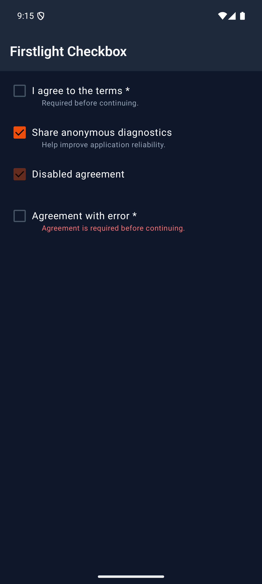

# Checkbox

Checkbox represents one Boolean form or checklist value. Use it for explicit
acknowledgements and selections that are normally saved with a form. Use
[Switch](switch.md) for a setting that takes effect immediately, or [Choice
Group](choice-group.md) for selection from a visible collection.

## Complete example

Declare a Boolean property on the native component, then bind it with
`native:model`:

```php
<?php

namespace App\NativeComponents;

use Illuminate\View\View;
use Native\Mobile\Edge\NativeComponent;

class Registration extends NativeComponent
{
    public bool $acceptedTerms = false;

    public function render(): View
    {
        return view('native.registration');
    }
}
```

```blade
<firstlight:checkbox
    native:model="acceptedTerms"
    label="I agree to the terms"
    helper="Required before continuing."
    required
    a11y-hint="Required before creating your account"
/>
```

## Props

| API | Accepted type | Purpose |
| --- | --- | --- |
| `value` | `bool` | Accepted value. Defaults to `false` when omitted. |
| `native:model` | a Boolean component property | Synchronises the accepted value through NativePHP. `native:model.live` is also accepted. |
| `label` | `string` | Visible checkbox label. |
| `helper` | `string` | Supporting text below the label. |
| `error` | `string` | Validation text and error semantics; shown instead of `helper` when non-empty. |
| `required` | `bool` | Marks the field as required visually and for assistive technology. |
| `disabled` | `bool` | Prevents proposals and change events while retaining the accepted value. |
| `a11y-label` | `string` | Explicit accessible name when a visible label is inappropriate. |
| `a11y-hint` | `string` | Additional VoiceOver and TalkBack guidance. |
| `class` | `string` | External EDGE layout utilities. |

The camel-case authoring aliases `a11yLabel` and `a11yHint` are accepted and
publish the same native props.

## Events

`@change` receives the proposed Boolean value. Use it when PHP decides whether
to accept a change:

```php
public bool $acceptedTerms = false;

public function updateAcceptedTerms(bool $value): void
{
    $this->acceptedTerms = $value;
}
```

```blade
<firstlight:checkbox
    :value="$acceptedTerms"
    @change="updateAcceptedTerms"
    label="I agree to the terms"
/>
```

`native:model` normally supplies the same callback for property
synchronisation.

## Accepted values

Checkbox accepts only strict PHP booleans: `true` and `false`. Bind a literal
Boolean with `:`:

```blade
<firstlight:checkbox :value="false" label="I agree to the terms" />
```

`value="false"` is invalid because Blade passes it as a string. `null`,
integers, string booleans, arrays, and objects are also rejected. Checkbox has
no nullable or indeterminate state.

## State timing

Checkbox is [server-authoritative](../concepts/server-authoritative-state.md).
A tap emits the inverse Boolean as one proposal, but the visible checkmark
remains at the last value published by PHP. An accepted response changes the
visible state; a rejected response republishes the previous state. Either
response clears the pending proposal guard. Programmatic publications update
the checkmark without emitting `@change`.

Use `native:model` or `native:model.live`. Deferred `blur`, `lazy`, and
`debounce` synchronisation modes are rejected.

## Disabled behaviour

When `disabled` is `true`, Checkbox stays visible with its accepted checked or
unchecked state. It cannot emit a proposal or `@change` event.

## Accessibility

Provide a visible `label` or an explicit `a11y-label`; Firstlight warns during
development when both are blank. Label, value, required state, hint, helper or
error feedback, and the native checkbox role form one accessibility target.
The visual checkmark is decorative to avoid a second focus stop.

iOS provides a minimum 44-point target and exposes a toggle trait with checked
state. Android provides a minimum 48-dp target with `Role.Checkbox` and one
TalkBack focus stop. Both platforms support wrapping text and system text
scaling.

## Validation and failure behaviour

Firstlight throws an actionable exception for non-Boolean `value`, `required`,
or `disabled` props. It also rejects unsupported indeterminate state, deferred
binding modes, placement, icons, colours, variants, `@press`, and `@submit`.
The component is self-closing and does not accept a content slot. Use `error`
for validation feedback; it replaces helper text and is included in
accessibility semantics.

## Platform behaviour

iOS uses an idiomatic SwiftUI checkmarked row built from a native `Button` and
SF Symbol state affordance. Android uses a genuine Material 3 `Checkbox` inside
a row-owned checkbox target. The public EDGE API and server-authoritative state
contract are shared, while geometry and interaction presentation remain native
to each platform.

## Compatibility

Checkbox supports the versions listed in the current [compatibility
reference](../reference/compatibility.md). The host application must compile
both Firstlight-owned native renderers declared by the package manifest.

## Screenshots

| Platform | Light | Dark |
| --- | --- | --- |
| iOS |  |  |
| Android |  |  |
