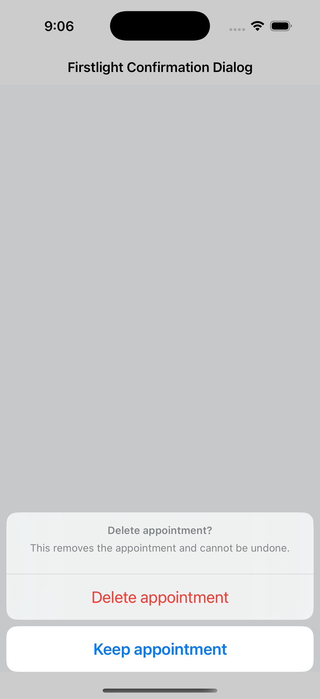
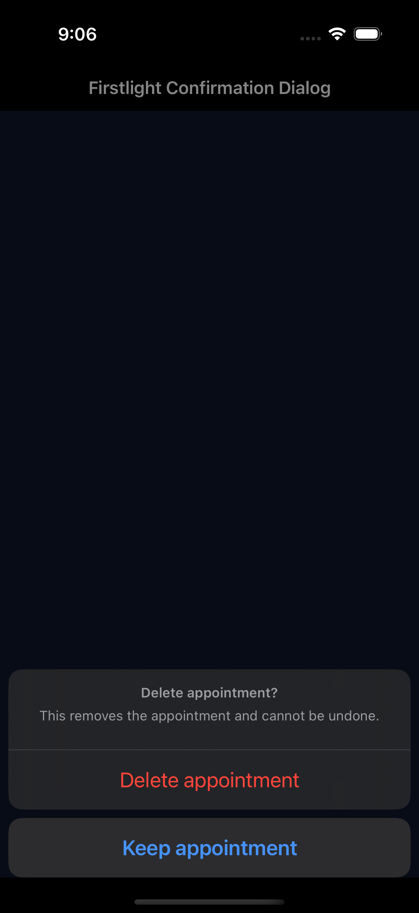
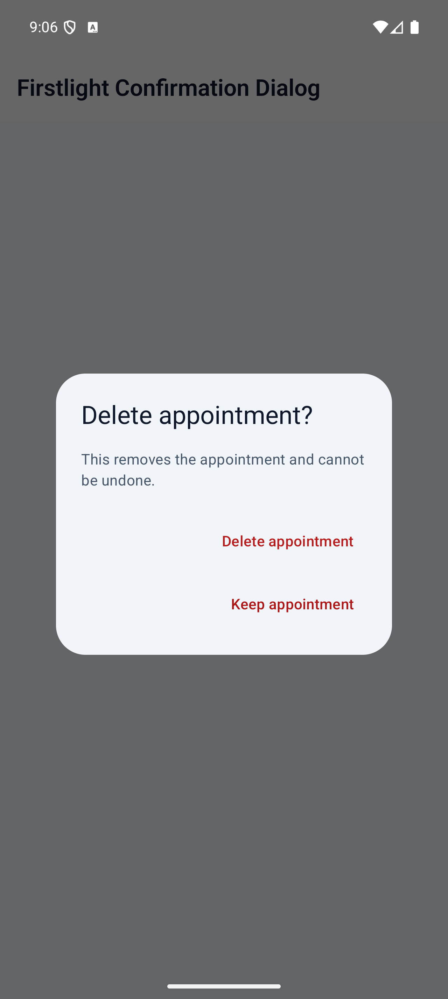
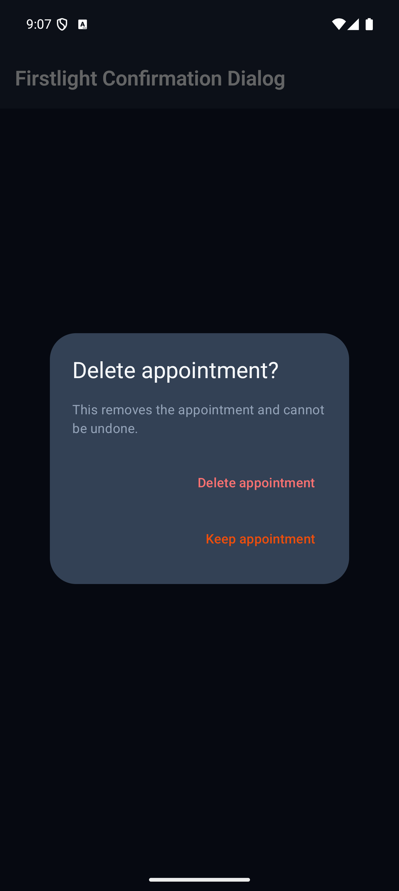

# Confirmation Dialog

Confirmation Dialog asks the user to confirm or cancel one consequential
action using the platform's native presentation and action ordering.

```blade
<firstlight:confirmation-dialog
    :visible="$confirmingDeletion"
    title="Delete appointment?"
    message="This action cannot be undone."
    confirm-label="Delete"
    cancel-label="Keep appointment"
    tone="destructive"
    @press="deleteAppointment"
    @dismiss="cancelDeletion"
/>
```

Both handlers should set `$confirmingDeletion` to `false`. The confirmation
handler also performs the action; the dismissal handler only cancels the
request.

## Props and events

- `visible`: server-controlled presentation request; defaults to `false`.
- `title`: required visible heading and accessible dialog name.
- `message`: required explanation of the decision or consequence.
- `confirm-label`: confirmation action text; defaults to `Confirm`.
- `cancel-label`: cancellation action text; defaults to `Cancel`.
- `tone`: `default` or `destructive`; defaults to `default`.
- `@press`: required callback for explicit confirmation.
- `@dismiss`: required callback for cancellation, back, or outside dismissal.
- `class`: external EDGE layout only.

The component always presents one confirm action and one cancel action. It
does not support arbitrary action lists, icons, loading or disabled states,
`native:model`, per-platform styling, or an undismissable mode. Use
[Alert Dialog](alert-dialog.md) when the user only needs to acknowledge a
message.

## Behavior and accessibility

One user outcome produces one callback. Programmatic closure produces none.
After a user dismisses the dialog, copy-only publications do not reopen it; a
later server transition from `false` to `true` presents a new decision.

iOS uses SwiftUI `confirmationDialog`; Android uses Material 3 `AlertDialog`.
Their native controls own modal focus, action order, destructive expression,
Dynamic Type or font scaling, dark appearance, contrast, reduced motion, and
right-to-left behavior. Use specific action labels such as `Delete` rather
than generic text when the consequence can be named.

## Screenshots

| Platform | Light | Dark |
| --- | --- | --- |
| iOS |  |  |
| Android |  |  |
