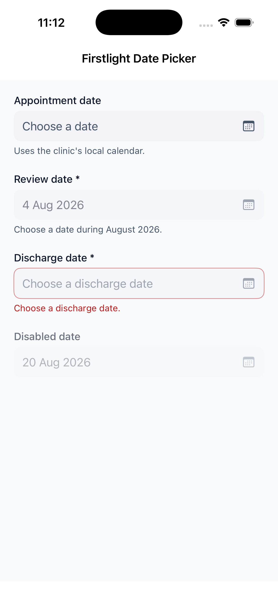
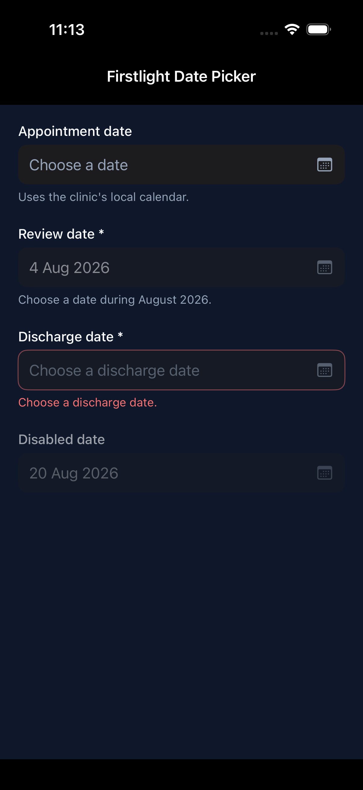
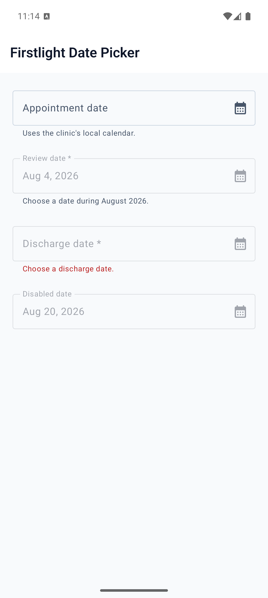

# Date Picker

Date Picker chooses one calendar date with the native date picker on each
platform. PHP remains authoritative: the closed field always shows the value
PHP most recently published.

## Complete example

```blade
<firstlight:date-picker
    label="Appointment date"
    placeholder="Choose a date"
    helper="Dates use the clinic's local calendar."
    min="2026-01-01"
    max="2026-12-31"
    locale="en-AU"
    timezone="Australia/Sydney"
    required
    native:model="appointmentDate"
/>
```

The bound property must contain a canonical `YYYY-MM-DD` string or `null`:

```php
public ?string $appointmentDate = null;
```

## Props

| API | Accepted type | Purpose |
| --- | --- | --- |
| `value` / `native:model` | `string|null` | Accepted canonical `YYYY-MM-DD` date, or `null` for no date; omission defaults to `null`. |
| `min` | `string|null` | Inclusive canonical lower bound. |
| `max` | `string|null` | Inclusive canonical upper bound. |
| `label` | `string` | Visible field label and accessibility-name fallback. |
| `placeholder` | `string` | Field text while the accepted value is `null`. |
| `helper` | `string` | Supporting guidance below the field. |
| `error` | `string` | Validation feedback that replaces helper text. |
| `required` | `bool` | Communicates required metadata; validation remains in PHP. |
| `disabled` | `bool` | Prevents opening and confirmation. |
| `locale` | BCP-47 string | Formats the field and native calendar without changing the wire date. |
| `timezone` | IANA timezone string | Determines today and Swift date mapping without shifting the wire date. |
| `a11y-label` | `string` | Explicit accessible name when no visible label is appropriate. |
| `a11y-hint` | `string` | Additional VoiceOver and TalkBack guidance. |
| `class` | `string` | External EDGE layout for the complete field. |

Omitted `value` and explicit `null` publish the same empty state. The component does not accept
`DateTimeInterface`, timestamps, whitespace, unpadded dates, or year zero.
Years `0001` through `9999` use proleptic Gregorian leap-year rules.

`min` and `max` are inclusive, must be ordered, and must contain an accepted
non-null value. Null bounds are omitted. Firstlight never silently clamps an
authored value.

## Events and synchronisation

`@change` receives a canonical date string only after the user confirms the
native presentation. In normal use, `native:model` registers this callback and
updates the bound property.

Plain `native:model` and `native:model.live` are equivalent because a date is
a discrete choice. Blur, lazy, and debounce modifiers are rejected.

Opening the picker, moving its draft, cancelling, confirming the already
accepted date, and programmatic PHP updates emit nothing. The trigger never
shows a draft optimistically. PHP may accept, reject, or replace a proposal;
the next tree publication remains the source of truth.

If accepted value, bounds, locale, timezone, or disabled state changes while
the picker is open, Firstlight dismisses it and discards its draft. A null
value initially drafts today in `timezone`, clamped to the nearest bound when
necessary, but does not publish until confirmation.

## Validation and accessibility

Contract exceptions still reject malformed locale or timezone values before
publication. User validation is separate: screens that `use ValidatesFields`
auto-bind the first MessageBag message for the field's `native:model` or
`error-for` name. An authored `error` wins. `required` is display metadata
and does not run Laravel rules. See
[Validate fields](../how-to/validate-fields.md).

A visible `label` or explicit `a11y-label` is required during development.
Error text replaces helper text without replacing the control's accessible
name or value. The field exposes its accepted localized value or placeholder,
hint, disabled state, and platform error semantics.

The calendar keeps native traversal, focus, selection, today, cancel, and
confirm behaviour. The field and actions retain at least a 44-point target on
iOS and 48-dp target on Android, and support Dynamic Type or font scaling,
dark mode, increased contrast, and right-to-left layout.

## Platform behaviour

iOS presents an adaptive popover or sheet containing a genuine graphical
SwiftUI `DatePicker` restricted to calendar dates, with explicit Cancel and
Confirm actions. Android presents the Material 3 `DatePickerDialog` from a
read-only Material field. Android maps Material's selected UTC-midnight cell
back to the same canonical date rather than treating it as a local instant.

Date Picker deliberately has no time or datetime mode, picker-style override,
hour format, clear action, custom presentation labels or icons, range mode, or
visual variant props.

## Screenshots

| Platform | Light | Dark |
| --- | --- | --- |
| iOS |  |  |
| Android |  |  |
