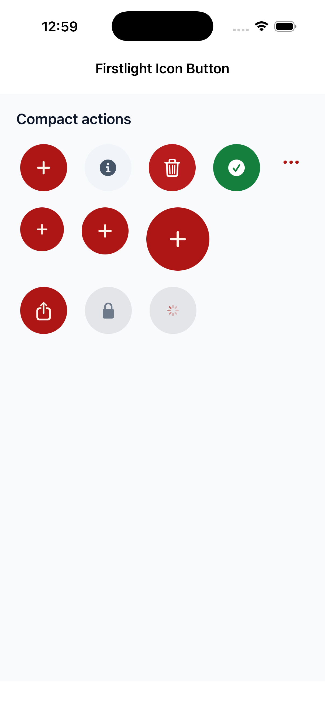
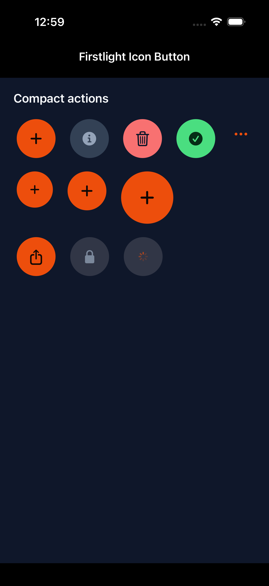
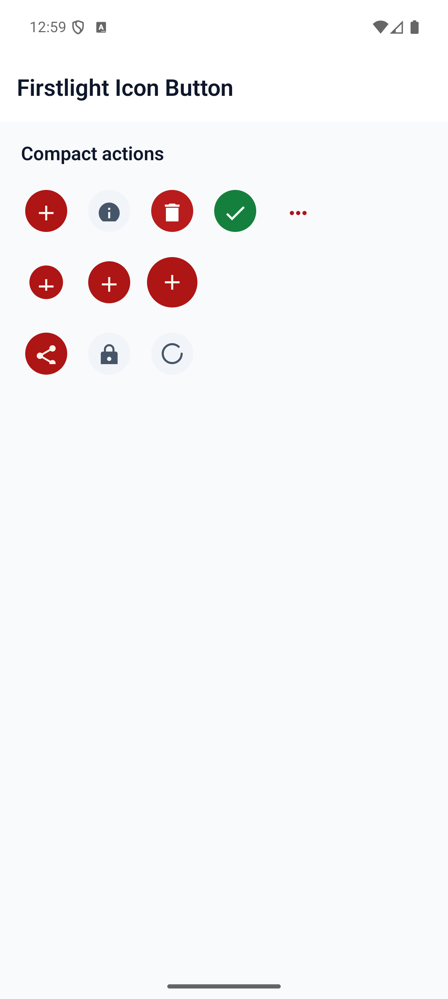
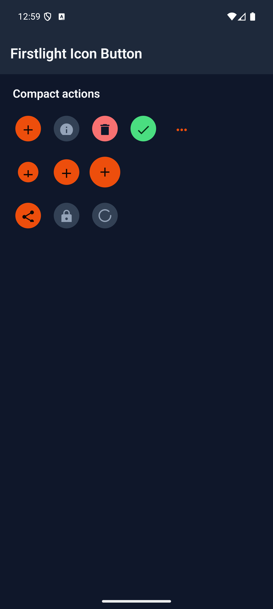

# Icon Button

Icon Button triggers one compact action represented by an icon. It renders as
a genuine SwiftUI button on iOS and the Material 3 Icon Button family on
Android while keeping one portable Firstlight API.

## Complete example

```blade
<firstlight:icon-button
    icon="plus"
    icon-ios="plus.circle"
    icon-android="add_circle"
    a11y-label="Add item"
    a11y-hint="Adds a blank item"
    variant="primary"
    size="md"
    :loading="$adding"
    :disabled="! $canAdd"
    @press="addItem"
/>
```

Icon Button is self-closing and has no visible text slot. Use
`<firstlight:button>` when the action needs a visible label, or
`<native:icon>` for a decorative or display-only glyph.

## Props

| API | Accepted type | Purpose |
| --- | --- | --- |
| `icon` | non-empty `string` | Required shared icon name and cross-platform fallback. |
| `icon-ios` | `IosSymbol|string` | Optional iOS override. |
| `icon-android` | `AndroidSymbol|string` | Optional Android override; typed filled or outlined variants are preserved on the wire. |
| `a11y-label` | non-empty `string` | Required accessible action name. Firstlight never derives it from the machine icon name. |
| `a11y-hint` | `string` | Optional supplementary VoiceOver or TalkBack guidance. |
| `variant` | `primary`, `secondary`, `destructive`, `success`, or `ghost` | Semantic action intent. Defaults to `primary`. |
| `size` | `sm`, `md`, or `lg` | Native glyph and container size. Defaults to `md`; the touch target remains at least 44 points or 48 dp. |
| `disabled` | `bool` | Prevents interaction and exposes native disabled state. Defaults to `false`. |
| `loading` | `bool` | Replaces the glyph with native progress, announces loading, and prevents duplicate presses. Defaults to `false`. |
| `class` | `string` | External EDGE layout utilities. |

Blade documentation uses `icon-ios` and `icon-android`. The equivalent
`iconIos` and `iconAndroid` aliases are accepted for parity with NativePHP.

## Events

`@press` is required and invokes the named PHP action once for a native user
press:

```php
public function addItem(): void
{
    // Persist the action and publish any resulting state.
}
```

Icon Button has no `value`, `native:model`, or `@change`. Disabled and loading
buttons do not emit. Programmatic publications never emit a press.

## Variants and sizes

The variants share the same semantic vocabulary as Firstlight Button. iOS
uses Apple-native prominent or plain button expression and theme tints.
Android uses `FilledIconButton`, `FilledTonalIconButton`, or `IconButton`
according to intent. `sm`, `md`, and `lg` scale the visible glyph and native
container without shrinking the accessible interaction target.

## Loading and disabled behaviour

`loading` keeps the explicit accessible name, substitutes a native progress
indicator, exposes a loading value or state description, and disables the
action until PHP publishes a non-loading state. `disabled` retains the icon
and name while exposing native disabled appearance and semantics.

## Accessibility

Every Icon Button requires `a11y-label`; familiar-looking icon names are not
accepted as an accessible-name substitute. The glyph is decorative inside one
button accessibility node. Native renderers expose the button role, optional
hint, disabled or loading state, focus and press feedback, and interaction
targets of at least 44 points on iOS and 48 dp on Android.

## Validation and excluded APIs

Firstlight rejects missing or blank icons, missing or blank accessibility
labels, missing `@press`, non-boolean state props, invalid variants and sizes,
unsupported platform icon values, visible labels or slots, trailing icons,
menus, navigation directives, extra gesture callbacks, bindings, field props,
and per-control colour or typography escape hatches.

## Compatibility

Icon Button supports the versions listed in the current
[compatibility reference](../reference/compatibility.md) and requires both
Firstlight native renderers to be compiled into the host application.

## Screenshots

| Platform | Light | Dark |
| --- | --- | --- |
| iOS |  |  |
| Android |  |  |
