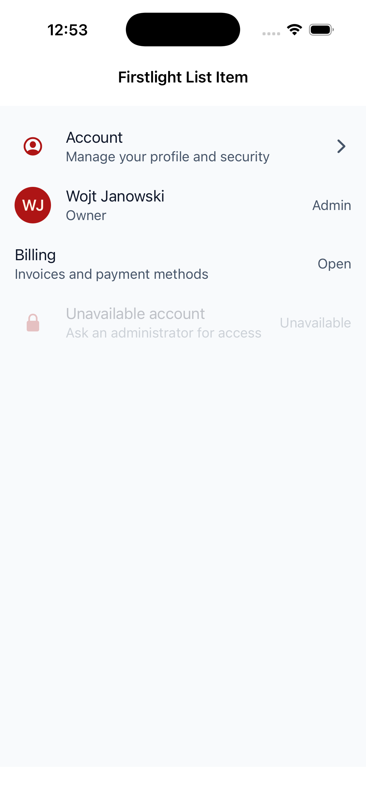
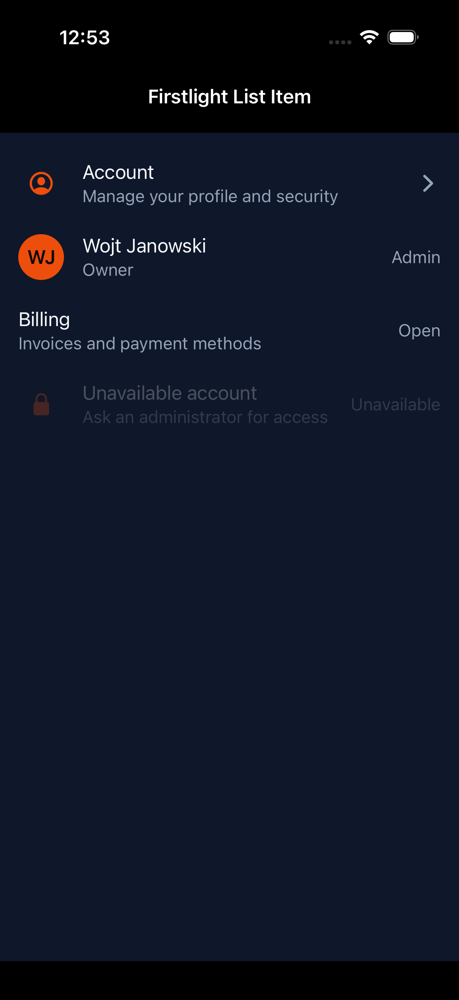
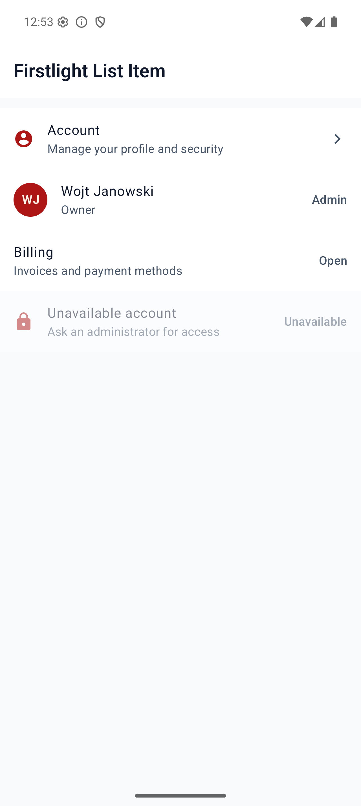
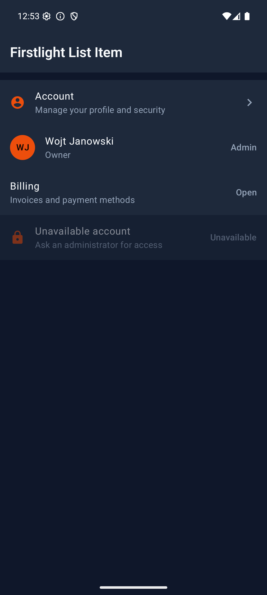

# List Item

List Item presents one tappable application row with a primary headline,
optional supporting text, an optional leading identity, and an optional
trailing affordance. It renders as a genuine SwiftUI button row on iOS and a
Material 3 List Item on Android.

## Complete example

```blade
<firstlight:list-item
    headline="Account"
    supporting="Manage your profile and security"
    leading-icon="person"
    leading-icon-ios="person.crop.circle"
    leading-icon-android="account_circle"
    trailing-icon="chevron-right"
    trailing-icon-ios="chevron.right"
    trailing-icon-android="chevron_right"
    a11y-hint="Opens account settings"
    :disabled="! $canManageAccount"
    @press="openAccount"
/>
```

List Item is self-closing. Its content is semantic rather than a general child
slot: arbitrary text, controls, and layouts cannot be nested inside the row.

## Props

| API | Accepted type | Purpose |
| --- | --- | --- |
| `headline` | non-empty `string` | Required primary text and default accessible name. |
| `supporting` | non-empty `string` | Optional secondary text below the headline. |
| `leading-icon` | non-empty `string` | Optional shared leading icon and cross-platform fallback. |
| `leading-icon-ios` | `IosSymbol|string` | Optional iOS override; requires `leading-icon`. |
| `leading-icon-android` | `AndroidSymbol|string` | Optional Android override; requires `leading-icon`; typed variants are preserved on the wire. |
| `leading-avatar` | non-empty `string` | Optional image source representing the row subject. |
| `leading-monogram` | one or two characters | Optional short identity marker such as `WJ`. |
| `trailing-icon` | non-empty `string` | Optional shared decorative affordance icon. |
| `trailing-icon-ios` | `IosSymbol|string` | Optional iOS override; requires `trailing-icon`. |
| `trailing-icon-android` | `AndroidSymbol|string` | Optional Android override; requires `trailing-icon`; typed variants are preserved on the wire. |
| `trailing-text` | non-empty `string` | Optional short metadata or affordance text. |
| `disabled` | `bool` | Prevents presses and exposes native disabled state. Defaults to `false`. |
| `a11y-label` | non-empty `string` | Optional replacement for the combined visible accessible name. |
| `a11y-hint` | non-empty `string` | Optional supplementary VoiceOver or TalkBack guidance. |
| `class` | `string` | External EDGE layout utilities. |

Choose at most one leading source: icon, avatar, or monogram. Choose at most
one trailing affordance: icon or text. Supporting text and both edges may be
omitted for a headline-only row.

Blade examples use kebab-case names. The equivalent `leadingIcon`,
`leadingIconIos`, `leadingIconAndroid`, `leadingAvatar`, `leadingMonogram`,
`trailingIcon`, `trailingIconIos`, `trailingIconAndroid`, and `trailingText`
aliases are also accepted for parity with NativePHP authoring.

## Events and state timing

`@press` is required and invokes the named PHP action once after a native user
press:

```php
public function openAccount(): void
{
    // Perform the action and publish any resulting screen state.
}
```

List Item has no `value`, `native:model`, selected state, or `@change`. The
native row owns only transient press feedback. PHP owns the action outcome and
publishes any subsequent headline, supporting text, affordance, accessibility,
or disabled state. Programmatic publications never emit a press.

## Disabled behaviour

A disabled row retains its visible content, uses native disabled appearance,
exposes disabled accessibility semantics, and does not emit `@press`. The
`disabled` value must be a real boolean; strings and integers are rejected.

## Leading identity and icons

Use `leading-avatar` when an image identifies the row subject, or
`leading-monogram` for a one- or two-character textual identity. Use
`leading-icon` for a semantic category or destination glyph. All leading
content is decorative inside the row's single accessibility node because the
headline carries the subject's accessible meaning.

Icon resolution happens in PHP. The shared icon is the deterministic fallback;
the iOS or Android override wins on its platform. A typed Android symbol keeps
its filled or outlined variant in the native wire metadata. Overrides without
their shared fallback are invalid.

## Trailing affordances

Use `trailing-icon` for a decorative directional or state affordance, or
`trailing-text` for short metadata such as `Admin`. The trailing content is not
a second action. It remains silent to assistive technology inside the row's
single button node.

Independent trailing buttons, switches, checkboxes, radio buttons, menus, and
swipe actions are excluded. Compose a separate Firstlight control when the
interface needs a second target.

## Accessibility

By default, assistive technology combines the headline and supporting text as
the row's accessible name. `a11y-label` replaces that name and `a11y-hint` adds
context. The complete row is one button node with disabled state and a minimum
interaction target of 44 points on iOS or 48 dp on Android.

Leading avatars, monograms, icons, and trailing content are decorative and do
not add duplicate VoiceOver or TalkBack stops. Dynamic Type, Android font
scaling, right-to-left layout, native contrast, focus, and press feedback remain
platform-owned.

## Validation and excluded APIs

Firstlight rejects missing or blank headlines, missing `@press`, blank optional
text, non-boolean disabled values, invalid icon override types, icon overrides
without shared fallbacks, ambiguous leading or trailing content, and content
slots. It also rejects overline text, embedded controls, independent trailing
actions, swipe and long-press gestures, menus, navigation directives, model or
selection state, loading and validation props, colours, elevation, typography,
and per-platform layout escape hatches.

## Platform behaviour

iOS uses a SwiftUI `Button` composition with Apple-native headline and
supporting typography, optional circular identity or SF Symbol, optional
trailing metadata or symbol, native press and disabled behaviour, and a
44-point minimum target.

Android uses Material 3 `ListItem` inside one enabled-aware clickable surface,
with Material typography, content slots, ripple and disabled semantics, and a
48-dp minimum target. Shared content and action meaning stay the same while
spacing, typography, motion, and pressed state remain native.

## Compatibility

List Item supports the versions listed in the current [compatibility
reference](../reference/compatibility.md). The host application must compile
both Firstlight-owned native renderers declared by the package manifest.

## Screenshots

| Platform | Light | Dark |
| --- | --- | --- |
| iOS |  |  |
| Android |  |  |
