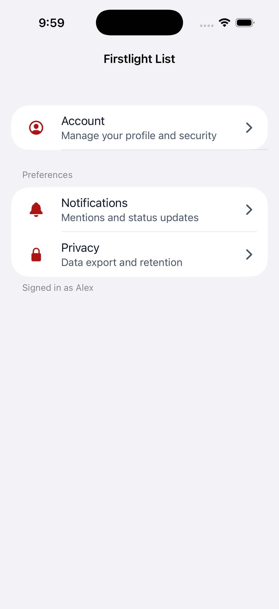
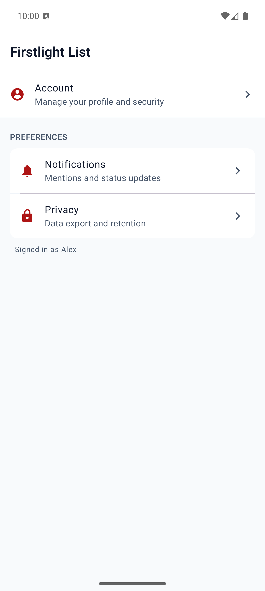
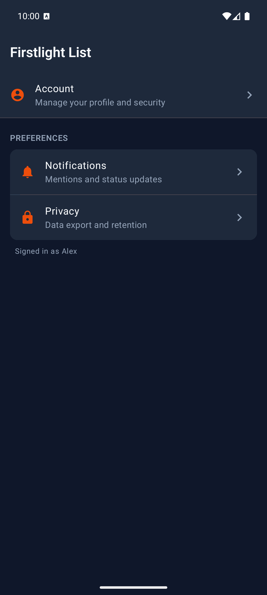

# List Section

List Section groups related [List Item](list-item.md) rows under an optional
header and footer inside a parent [List](list.md).

## Complete example

```blade
<firstlight:list>
    <firstlight:list-section header="Account" footer="Signed in as Alex">
        <firstlight:list-item headline="Profile" @press="openProfile" />
        <firstlight:list-item headline="Security" @press="openSecurity" />
    </firstlight:list-section>
</firstlight:list>
```

List Section is a paired container and must live inside List. A section
authored on its own does not render application content.

## Props

| API | Accepted type | Purpose |
| --- | --- | --- |
| `header` | non-empty `string` | Optional section title. |
| `footer` | non-empty `string` | Optional section footnote. |

At least one List Item child is required.

## Composition rules

- Child slot accepts only `firstlight:list-item`.
- Nested sections, refresh hooks, separators, and field props belong on the
  parent List instead.

## Platform expression

The parent List renderer consumes List Section inline:

- iOS renders SwiftUI section headers and footers.
- Android renders sticky headers, grouped card rows, and footer text.

## Adapter note

The public tag is `<firstlight:list-section>`, but the published wire type
remains `list_section` so the delegated Mobile UI list renderer can apply
grouped section styling.

## Screenshots

| Platform | Light | Dark |
| --- | --- | --- |
| iOS |  |  |
| Android |  |  |
