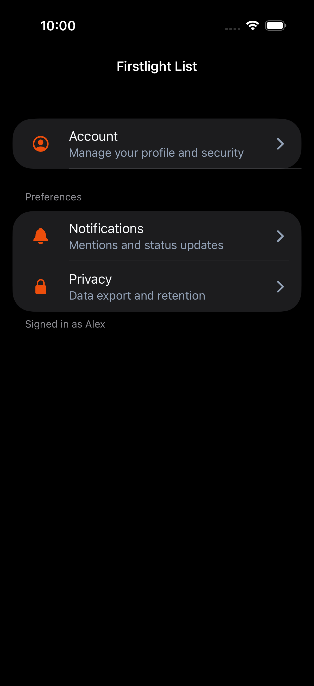

# List

List presents a finite vertical collection of application rows. Compose rows
with [List Item](list-item.md) and optional grouped sections with
[List Section](list-section.md).

## Complete example

```blade
<firstlight:list separator @refresh="reloadItems" @end-reached="loadMore">
    <firstlight:list-item headline="Account" @press="openAccount" />

    <firstlight:list-section header="Preferences" footer="Changes sync automatically">
        <firstlight:list-item headline="Notifications" @press="openNotifications" />
        <firstlight:list-item headline="Privacy" @press="openPrivacy" />
    </firstlight:list-section>
</firstlight:list>
```

List is a paired container. Only List Item and List Section children are
accepted.

## Props

| API | Accepted type | Purpose |
| --- | --- | --- |
| `separator` | `bool` | Shows native dividers between rows. Defaults to `false`. |
| `plain` | `bool` | When sections are present, keeps flat rows with sticky headers instead of grouped inset cards. Defaults to `false`. |
| `shows-indicators` | `bool` | Controls native scroll indicator visibility. Defaults to upstream platform behaviour when omitted. |
| `class` | `string` | External EDGE layout utilities. |

## Events

`@refresh` enables native pull-to-refresh and invokes the named PHP action when
the user pulls to refresh.

`@end-reached` invokes the named PHP action when the viewport nears the final
leaf row. It is intended for pagination rather than precise scroll offsets.
See [Paginate lists](../how-to/paginate-lists.md) to bind Laravel paginators
to these events.

## Composition rules

- Every row is a `firstlight:list-item` with its own required `@press` handler.
- Group related rows with `firstlight:list-section`. Sections require at least
  one List Item child.
- Horizontal lists, virtualized windows, selectable collections, and arbitrary
  child components are outside the Firstlight List contract.

## Platform expression

List delegates scrolling, separators, grouped section chrome, pull-to-refresh,
and end-reached detection to the official Mobile UI list renderer on both
platforms while retaining Firstlight List Item rows.

## Adapter note

List is an adapter over Mobile UI `list`. List Section publishes the upstream
wire type `list_section` so the delegated renderer recognizes grouped sections
while the public tag remains `<firstlight:list-section>`.

## Screenshots

| Platform | Light | Dark |
| --- | --- | --- |
| iOS |  |  |
| Android |  |  |
