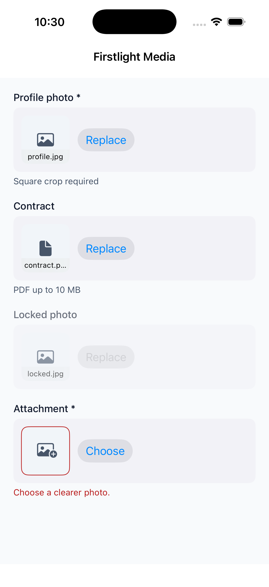
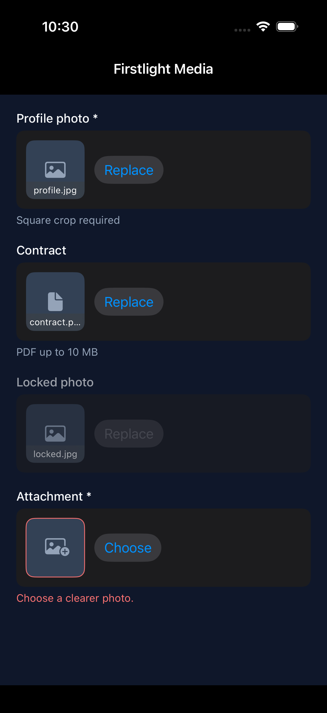
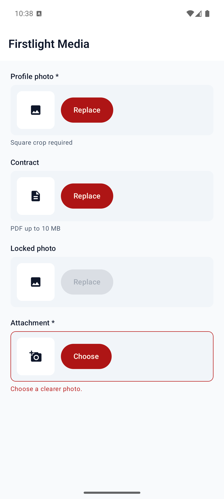
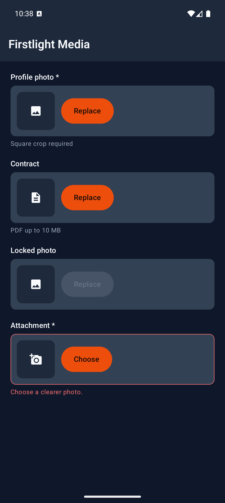

# Media

Media captures exactly one image or one document into Laravel Storage and
binds a `MediaValue` on your native component. Use it when you need a form
field with preview, clear, optional crop, and the same `error` slot as other
Firstlight fields.

## Complete example

```php
<?php

namespace App\NativeComponents;

use FirstlightUI\Media\MediaStorage;
use FirstlightUI\Media\MediaValue;
use Illuminate\View\View;
use Native\Mobile\Edge\NativeComponent;

class Profile extends NativeComponent
{
    public ?MediaValue $avatar = null;

    /** @var array<string, string> */
    protected array $rules = [
        'avatar' => 'required|image|max:2048',
    ];

    public function avatarChosen(string $tempPath): void
    {
        $previous = $this->avatar;
        $this->avatar = MediaStorage::commit(
            $tempPath,
            'mobile_public',
            'avatars',
        );
        MediaStorage::delete($previous);
    }

    public function avatarCleared(): void
    {
        MediaStorage::delete($this->avatar);
        $this->avatar = null;
    }

    public function render(): View
    {
        return view('native.profile');
    }
}
```

```blade
<firstlight:media
    mode="image"
    label="Profile photo"
    helper="Square crop required"
    aspect="1:1"
    disk="mobile_public"
    directory="avatars"
    native:model="avatar"
    @change="avatarChosen"
    @clear="avatarCleared"
/>
```

## Props

| API | Accepted type | Purpose |
| --- | --- | --- |
| `mode` | `image` \| `document` | Required. Image allows camera/library and crop; document uses the system file picker only. |
| `value` | `MediaValue` \| `null` | Committed value. Empty is `null`. |
| `native:model` | a `?MediaValue` component property | Synchronises the accepted value. `native:model.live` is also accepted. |
| `label` | `string` | Visible field label. |
| `helper` | `string` | Supporting text below the control. |
| `error` | `string` | Validation text; shown instead of `helper` when non-empty. |
| `required` | `bool` | Marks the field as required visually and for assistive technology. |
| `disabled` | `bool` | Prevents pick and clear while retaining the accepted value. |
| `disk` | `string` | Laravel Storage disk. Defaults to `mobile_public`. |
| `directory` | `string` | Directory prefix under the disk. Defaults to `media`. |
| `aspect` | ratio string such as `1:1` | Image only. Implies required crop to that aspect. |
| `crop` | `optional` \| `required` | Image only. Freeform crop when `aspect` is omitted. |
| `a11y-label` | `string` | Explicit accessible name when needed. |
| `a11y-hint` | `string` | Additional VoiceOver and TalkBack guidance. |
| `class` | `string` | External EDGE layout utilities. |

Document mode rejects `crop` and `aspect`. Unsupported attributes such as
`multiple` and `video` are rejected before publication.

### Crop rules

- Neither `crop` nor `aspect` → store without a crop sheet.
- `aspect` → required crop locked to that aspect.
- `crop="optional"` without aspect → freeform crop; Skip is allowed.
- `crop="required"` without aspect → freeform crop; Confirm is required.

Clear, Skip, Confirm, Cancel, Crop, zoom, and source-chooser copy are package
chrome; see [Localize chrome](../how-to/localize.md).

## Events

`@change` receives the temporary absolute file path after the user confirms a
pick (and crop when required). Commit with `MediaStorage::commit` before
assigning `MediaValue`.

`@clear` fires when the user clears a present value. Delete the previous
object with `MediaStorage::delete` and set the model to `null`.

## MediaValue

```php
new MediaValue(
    disk: 'mobile_public',
    path: 'avatars/a.jpg',
    mime: 'image/jpeg',
    size: 1200,
    width: 100,
    height: 100,
);
```

Display with `Storage::disk($value->disk)->url($value->path)`.

## Validation

Media participates in [Validate fields](../how-to/validate-fields.md). Public
`MediaValue` properties are adapted to Laravel `UploadedFile` values so stock
`image`, `file`, `mimes`, `max`, and `dimensions` rules work. `null` fails
`required`. Authored `error` wins over the MessageBag binder.

## Accessibility

The field exposes a labelled control with helper or error text. Crop sheets
include Confirm, Cancel, optional Skip, and explicit zoom in/out controls
meeting 44-point (iOS) and 48-dp (Android) minima. Zoom is not pinch-only.

## Platform behaviour

iOS uses PhotosPicker, camera capture, and fileImporter with a Firstlight
SwiftUI crop sheet. Android uses Material 3 field chrome and a Firstlight
Compose crop dialog. Geometry and system pickers stay platform-native; crop
semantics stay shared.

## Compatibility

Media supports the versions listed in the current [compatibility
reference](../reference/compatibility.md). The host application must compile
both Firstlight-owned native renderers declared by the package manifest.

## Screenshots

| Platform | Light | Dark |
| --- | --- | --- |
| iOS |  |  |
| Android |  |  |
