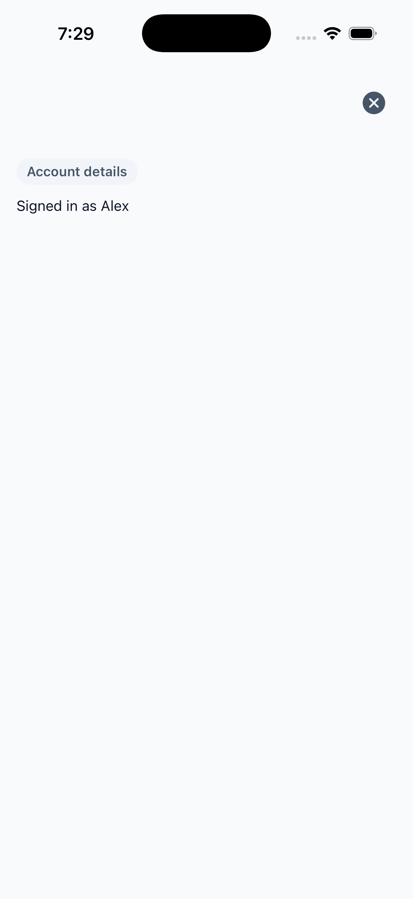
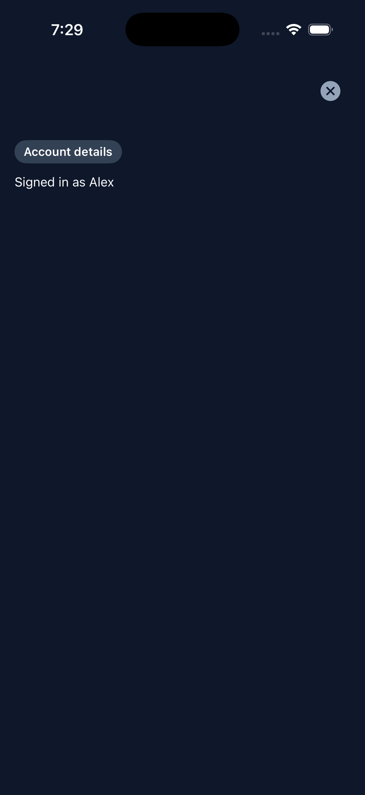
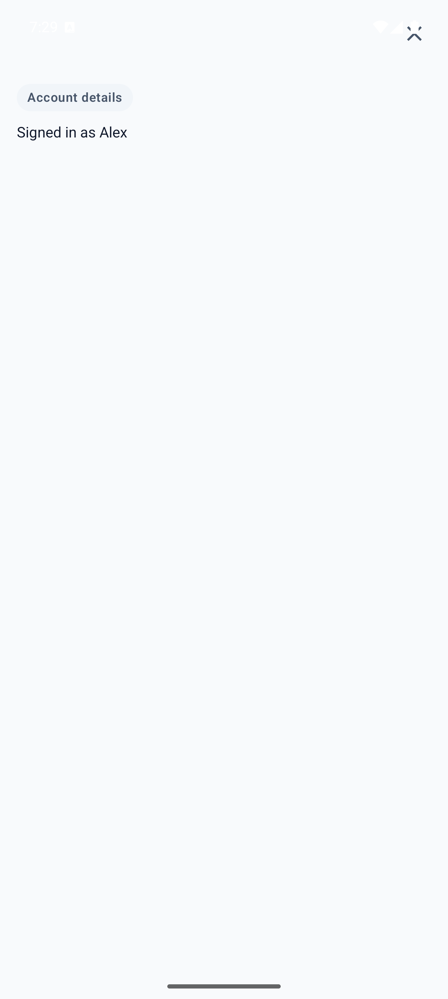
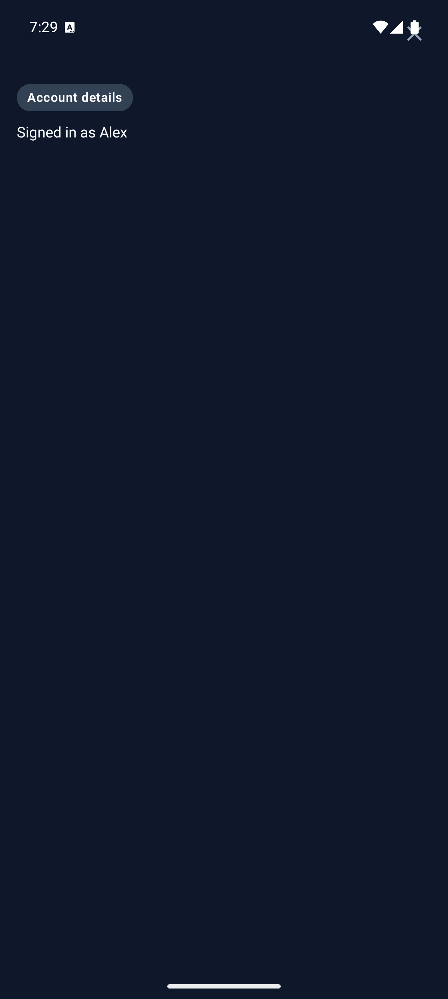

# Modal

Modal presents authored content in a full-screen native overlay. PHP owns
whether the overlay is requested; each platform owns cover or dialog chrome
and motion.

Use [Confirmation Dialog](confirmation-dialog.md) for a single confirm/cancel
decision. Use [Bottom Sheet](bottom-sheet.md) for a panel that slides up from
the bottom.

## Complete example

```blade
<firstlight:modal
    :visible="$showingAccount"
    a11y-label="Account details"
    @dismiss="closeAccount"
>
    <firstlight:status-label label="Account details" />
</firstlight:modal>
```

The dismiss handler should set `$showingAccount` to `false`.

## Props

| API | Accepted type | Purpose |
| --- | --- | --- |
| `visible` | `bool` | Server-controlled presentation request. Defaults to closed. |
| `dismissible` | `bool` | When true, native close, back, and outside dismissal are enabled. Defaults to the upstream native default of `true`. The `dismissable` alias is accepted. |
| `a11y-label` | non-empty `string` | Accessible name for the presented surface. |
| `a11y-hint` | non-empty `string` | Supplementary screen-reader guidance. |
| `class` | `string` | External EDGE layout utilities. |

## Events

`@dismiss` is required. It runs when the user closes the overlay. Set the
bound visibility property to `false` in that handler. Dismiss handlers must
be safe to run more than once because the delegated iOS cover can also notify
PHP when a programmatic close is published.

There is no overlay `@press`, `native:model`, or detent API. Actions belong
on child controls.

## Platform expression

Modal is an adapter over Mobile UI `modal`. iOS uses SwiftUI
`.fullScreenCover`; Android uses a Material full-screen dialog. Theme tokens
own surface colour. Close controls, when shown, use the native Close name.

## Screenshots

| Platform | Light | Dark |
| --- | --- | --- |
| iOS |  |  |
| Android |  |  |
