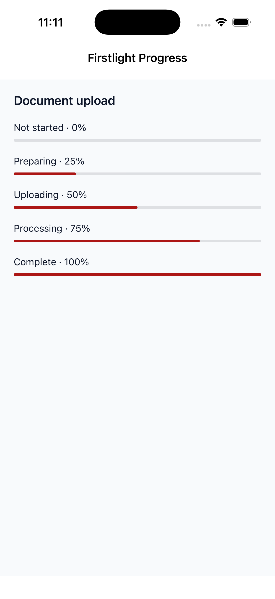
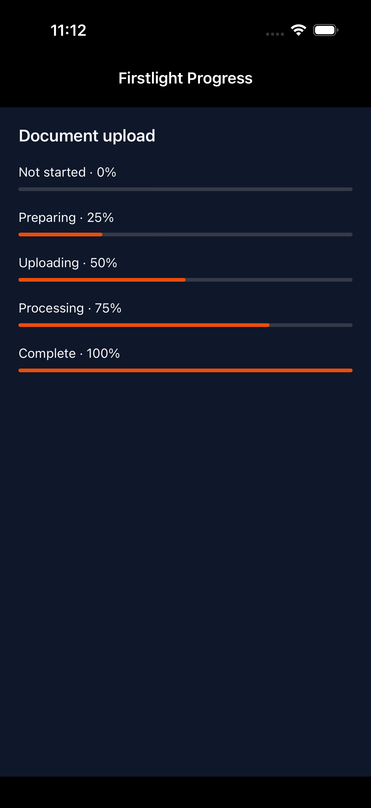
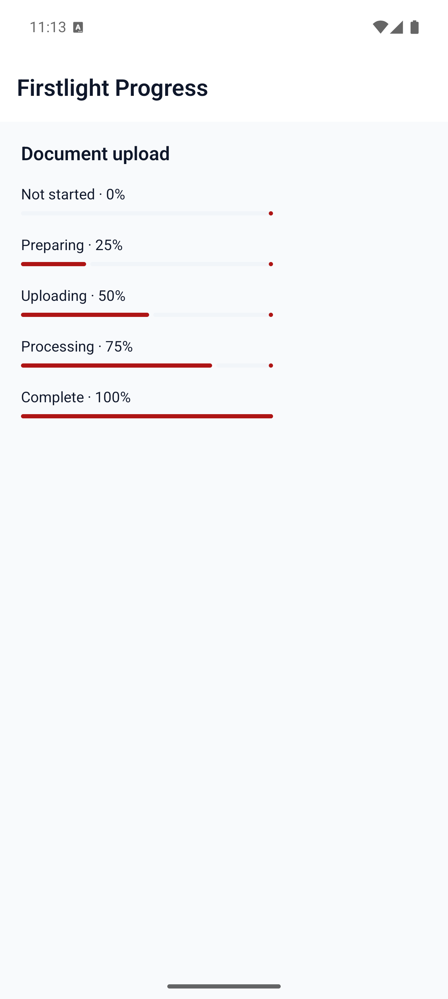
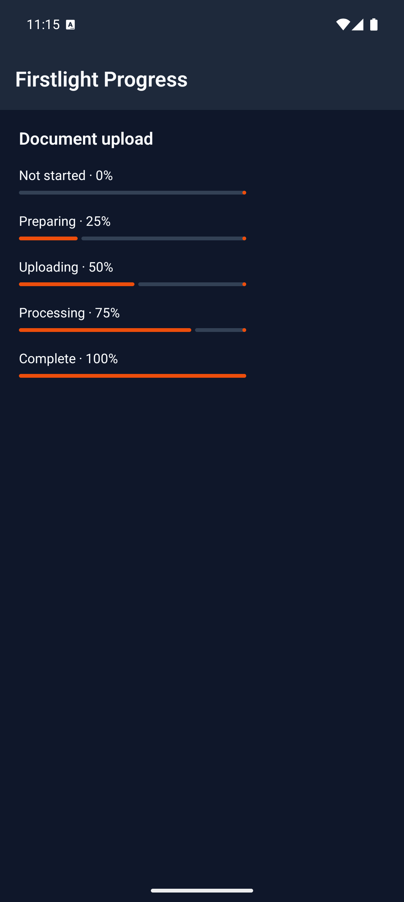

# Progress

Progress communicates the completion of ongoing work. Publish a fraction when
completion is measurable, or use indeterminate progress while the duration is
unknown.

Firstlight wraps the native progress component from `nativephp/mobile-ui`. The
public `<firstlight:progress>` API adds strict values, reliable mode defaults,
and actionable diagnostics while retaining the official SwiftUI and Material 3
renderers.

## Complete examples

Publish a determinate fraction from `0.0` through `1.0`:

```blade
<firstlight:progress
    :value="$completed / $total"
    a11y-label="Uploading documents"
/>
```

Use indeterminate progress when no meaningful fraction is available:

```blade
<firstlight:progress
    indeterminate
    a11y-label="Preparing documents"
/>
```

Omitting `value` also selects indeterminate progress.

## Props

| API | Accepted type | Purpose |
| --- | --- | --- |
| `value` | finite `int`, `float`, or `null` | Published completion fraction from `0.0` through `1.0`. A non-null value selects determinate mode. |
| `indeterminate` | `bool` | Explicitly selects or rejects indeterminate mode. Normally inferred from `value`. |
| `a11y-label` | non-empty `string` | Required accessible name describing the work. |
| `class` | `string` | External EDGE layout utilities. |

An integer value is published as a float. `0` means determinate progress that
has not advanced; it is different from an omitted or `null` value. `1` means
the reported work is complete, but the application decides when to remove the
indicator or present its result.

Explicit `indeterminate="true"` cannot be combined with a non-null `value`.
Explicit `indeterminate="false"` requires a non-null value.

## Events and state timing

Progress has no event or model binding. PHP publishes the current value or
mode through the ordinary Element Tree, and programmatic updates change the
native presentation without producing a callback.

Indeterminate animation stays within the native control. Firstlight does not
run a timer, publish animation frames, or use a separate bridge.

## Disabled, loading, and failure behaviour

Progress already describes loading work, so it has no separate `loading`
state. It is display-only and therefore has no disabled, error, helper,
required, selected, or pressed state.

Values must be actual finite PHP integers or floats within `0.0...1.0`.
Numeric strings, booleans, `NaN`, infinities, negative values, and values above
`1.0` fail instead of being clamped. A missing, empty, or non-string
`a11y-label` also fails.

Firstlight does not expose Mobile UI's arbitrary `color` or Android-only
`track-color` overrides. It also rejects `label`, `a11y-hint`, `tone`,
`variant`, `size`, icons, events, and field props. The installed native
Progress renderers do not consume `a11y-hint`, so Firstlight does not pretend
that the metadata reaches assistive technology.

## Accessibility

Progress has no visible text inside its bounds, so `a11y-label` is required.
VoiceOver and TalkBack combine that name with the native progress role and the
system-formatted value for determinate progress. Indeterminate progress
communicates ongoing activity without inventing a percentage.

The native controls retain platform contrast, right-to-left behaviour,
Increased Contrast, and Reduced Motion or disabled-animation policy. Progress
contains no text that needs a custom scaling treatment.

## Platform behaviour

iOS uses SwiftUI `ProgressView()`: the indeterminate initializer for unknown
duration and `ProgressView(value:)` for a published fraction. Android uses the
corresponding indeterminate or determinate Material 3
`LinearProgressIndicator` overload.

Both inherit the host Mobile UI semantic theme. The platforms retain their own
geometry and motion; behavioural parity does not require identical pixels.

## Why an adapter?

Mobile UI already provides genuine native linear indicators, determinate and
indeterminate presentation, semantic theme colours, native animation, and
accessible progress values on both platforms. Firstlight therefore keeps its
own namespace and strict public contract while delegating rendering rather
than duplicating those controls.

The public Element Tree type remains `firstlight.progress`. Firstlight can move
to package-owned renderers later without changing consumer markup if a durable
cross-platform requirement genuinely outgrows the official primitive.

## Compatibility

Progress supports the versions in the current [compatibility
reference](../reference/compatibility.md). The host application must compile
the installed `nativephp/mobile-ui` iOS and Android progress renderers declared
by the Firstlight adapter.

## Screenshots

| Platform | Light | Dark |
| --- | --- | --- |
| iOS |  |  |
| Android |  |  |
