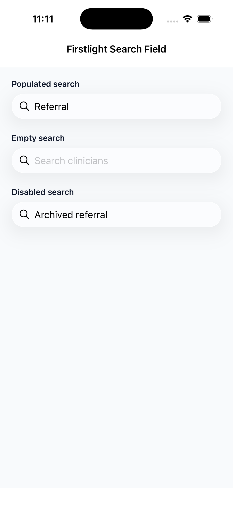
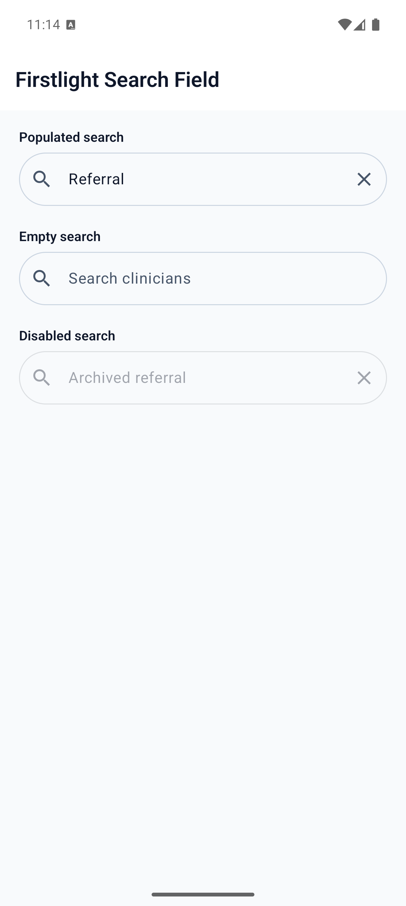

# Search Field

Search Field enters and submits one query using each platform's native search,
keyboard, selection, clear, focus, and accessibility behaviour.

## Complete example

```blade
<firstlight:search-field
    placeholder="Search referrals"
    a11y-label="Search referrals"
    a11y-hint="Enter a patient, provider, or specialty"
    autocapitalize="words"
    :autocorrect="false"
    native:model.debounce.300ms="query"
    @submit="search"
/>
```

## Props

| API | Accepted type | Purpose |
| --- | --- | --- |
| `value` / `native:model` | `string` | Published query; omission defaults to `''`. |
| `placeholder` | `string` | Empty-query prompt; never the accessible name. |
| `disabled` | `bool` | Prevents focus, editing, clearing, change, and submit. |
| `autocapitalize` | enum string | `none`, `sentences`, `words`, or `characters`; omission keeps platform policy. |
| `autocorrect` | `bool` | Explicitly enables or disables correction; omission keeps platform policy. |
| `a11y-label` | non-empty `string` | Required accessible name. |
| `a11y-hint` | `string` | Additional VoiceOver and TalkBack guidance. |
| `class` | `string` | External EDGE layout for the complete field. |

The search icon and clear button are semantic native affordances. They are not
configurable icon slots. Both platforms use the package chrome
`clear_search` accessibility label on the clear control. See
[Localize chrome](../how-to/localize.md). Search Field has no visible label,
helper, error, required, read-only, secure, keyboard, content-type, size, tone,
or variant API.

## Events and synchronisation

`@change` receives the current query string. `@submit` first flushes any pending
change and then receives the query. Submitting an empty query still calls the
handler.

Plain `native:model` and `.live` publish every edit. `.blur` and `.lazy` publish
on focus loss or submit. `.debounce.300ms` publishes after the quiet period and
flushes on focus loss or submit; durations below 50 ms fail.

Native typing, selection, cursor position, and marked-text composition stay in
the focused editing buffer. PHP acknowledgements do not reset focus or selection,
and programmatic values received while unfocused never emit user events.

The native clear action appears for a non-empty enabled query. It retains focus
and immediately publishes `''` through `@change`, including under blur or
debounce synchronisation.

## Validation and accessibility

Values, placeholders, labels, and hints are strict strings. `a11y-label` is
mandatory and cannot be blank. Unsupported general-field attributes, invalid
capitalization or sync modes, and invalid debounce durations fail with
actionable exceptions.

The field keeps its native editable-text role, value, focus, and disabled state.
The semantic search icon is decorative. The clear action has its own localized
accessible name and meets the 44-point iOS or 48-dp Android target baseline.

## Platform behaviour

iOS embeds `UISearchTextField`, so UIKit owns search chrome, the search and clear
affordances, cursor, selection, marked text, keyboard, and Dynamic Type. Android
uses a Material 3 search-field composition with `TextFieldValue`, the search IME
action, Material search/clear affordances, Compose semantics, and font scaling.

## Screenshots

| Platform | Light | Dark |
| --- | --- | --- |
| iOS |  |  |
| Android |  |  |
