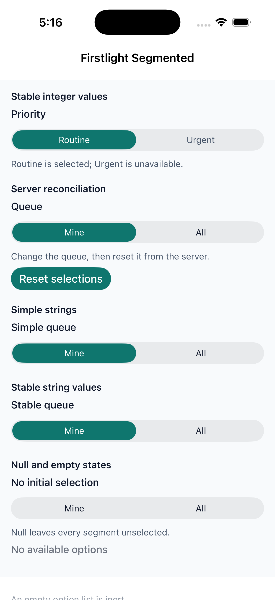
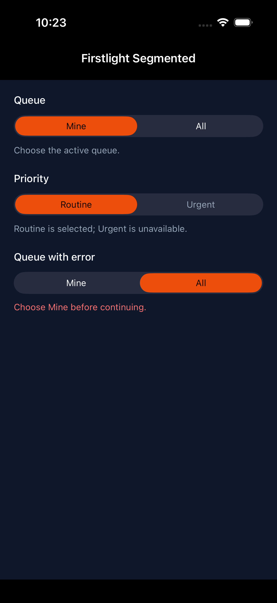
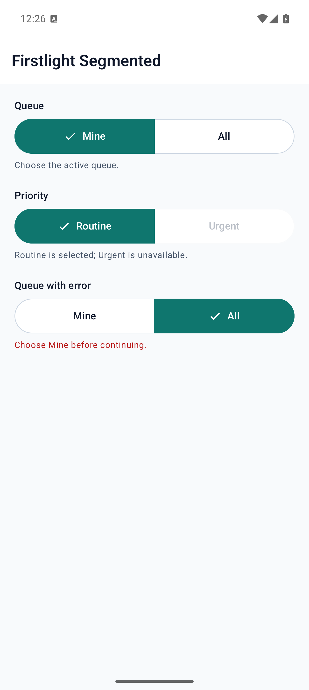
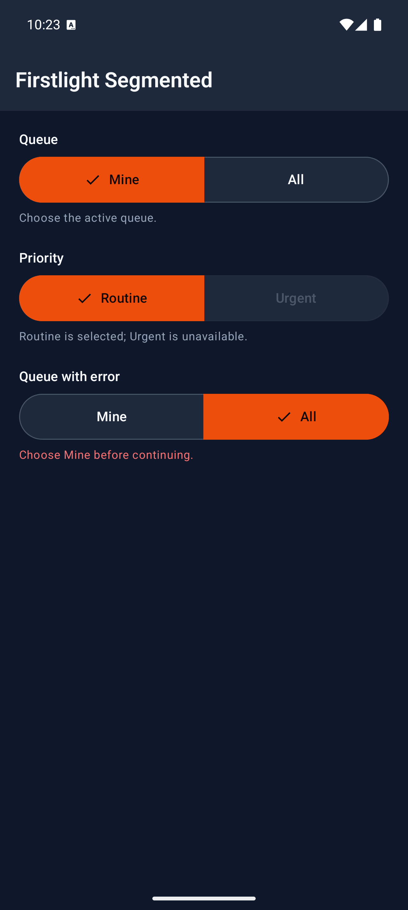

# Segmented

Segmented presents a small set of mutually exclusive choices as a native segmented control.

## Complete example

```php
public int $priority = 10;

public array $priorityOptions = [
    ['value' => 10, 'label' => 'Routine'],
    ['value' => 20, 'label' => 'Urgent', 'disabled' => true],
];
```

```blade
<firstlight:segmented
    :options="$priorityOptions"
    native:model="priority"
    label="Priority"
    helper="Choose a response priority."
    a11y-hint="Urgent may be unavailable."
/>
```

## Props

| API | Accepted type | Purpose |
| --- | --- | --- |
| `options` | `array` | Simple strings, a value-to-label map, or rich option arrays. |
| `value` / `native:model` | `string`, `int`, or `null` | Stable selected value. Its type must match the option values. |
| `label` | `string` | Visible field label. |
| `helper` | `string` | Supporting text below the control. |
| `error` | `string` | Error text and error semantics. |
| `required` | `bool` | Marks the field as required. |
| `disabled` | `bool` | Disables the complete control. |
| `a11y-label` | `string` | Explicit accessibility label when a visible label is inappropriate. |
| `a11y-hint` | `string` | Additional VoiceOver and TalkBack guidance. |
| `class` | `string` | External EDGE layout utilities. |

## Events

`@change` receives the selected stable value. `native:model` normally generates this callback for property synchronisation. A user selection emits immediately; server reconciliation and programmatic updates do not emit.

## Options and accepted values

Simple string options use the same value and label:

```php
['Mine', 'All']
```

A map separates stable values from labels and may use all-string or all-integer keys:

```php
['mine' => 'Mine', 'all' => 'All']
```

Rich options accept only `value`, `label`, and optional `disabled` fields:

```php
[
    ['value' => 'mine', 'label' => 'Mine'],
    ['value' => 'all', 'label' => 'All', 'disabled' => true],
]
```

All values in one control must be uniquely typed strings or uniquely typed integers. `null` represents no selection; an empty string remains a distinct string value.

## State timing

Segmented is [server-authoritative](../concepts/server-authoritative-state.md). A tap emits immediately, while PHP's next published value determines the visible selection. Use plain `native:model` or `native:model.live`; deferred `blur` and `debounce` modes are rejected.

## Disabled behaviour

`disabled` prevents every choice from emitting. A rich option's `disabled: true` prevents only that option from emitting. An empty option set becomes an inert disabled control. A disabled or already-selected choice does not emit a new change.

## Accessibility

Provide either a visible `label` or an explicit `a11y-label`. Firstlight warns during development when both are blank. The renderers expose the label or explicit accessibility label, optional hint, selected state, disabled state, required indication, helper text, and error text through native platform semantics.

## Validation and failure behaviour

Firstlight throws an actionable exception for mixed string and integer values, duplicate values, missing rich-option fields, unknown rich-option fields, non-string labels, non-boolean disabled flags, unsupported value types, or a selected value whose type differs from the options. A same-typed value absent from `options` remains visibly unselected rather than selecting the first option.

## Platform behaviour

iOS uses a native SwiftUI field backed by `UISegmentedControl`. Android uses Material 3 `SingleChoiceSegmentedButtonRow` and `SegmentedButton`. The controls share behaviour and authored API while retaining platform-native styling, layout, and interaction.

## Compatibility

Segmented supports the versions listed in the current [compatibility reference](../reference/compatibility.md) and requires both native renderers to be compiled into the host application.

## Screenshots

| Platform | Light | Dark |
| --- | --- | --- |
| iOS |  |  |
| Android |  |  |
