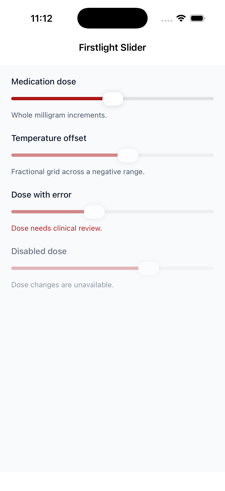
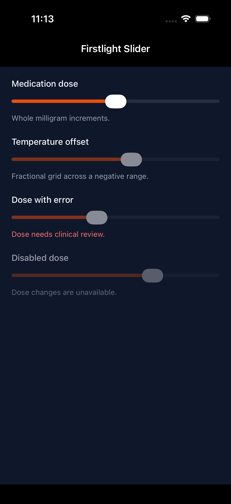
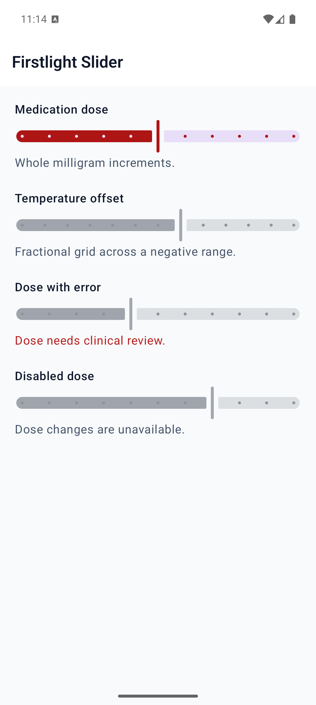
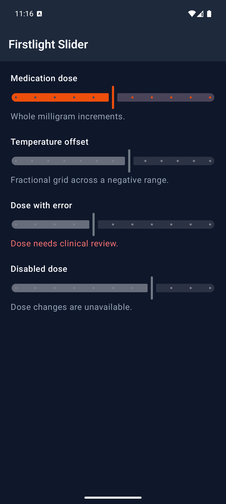

# Slider

Slider selects one numeric value from a finite, evenly spaced range using the
native platform slider. PHP owns the accepted value; the platform owns a draft
only while the user is interacting.

## Complete example

```blade
<firstlight:slider
    native:model.blur="dose"
    :min="0"
    :max="10"
    :step="0.5"
    label="Dose"
    helper="Choose a dose in half-milligram increments."
    a11y-value="5 milligrams"
/>
```

Use Blade's `:` binding for numeric literals so PHP receives actual numbers,
not numeric strings. The bound property receives a PHP `float`, including when the authored range
and step contain only whole numbers:

```php
public float $dose = 5.0;
```

## Props

| API | Accepted type | Purpose |
| --- | --- | --- |
| `value` / `native:model` | finite `int|float` | Required accepted value. Published to native renderers as a float. |
| `min` | finite `int|float` | Required inclusive lower bound. |
| `max` | finite `int|float` | Required inclusive upper bound. |
| `step` | finite positive `int|float` | Grid spacing from `min`; defaults to `1`. |
| `label` | `string` | Visible field label and accessibility-name fallback. |
| `helper` | `string` | Supporting guidance below the control. |
| `error` | `string` | Validation feedback that replaces helper text. |
| `disabled` | `bool` | Prevents native editing and publication. |
| `a11y-label` | `string` | Explicit accessible name when no visible label is appropriate. |
| `a11y-hint` | `string` | Additional VoiceOver and TalkBack guidance. |
| `a11y-value` | `string` | Optional spoken value, such as a number with units; it is never shown visibly. |
| `class` | `string` | External EDGE layout for the complete field. |

`min` must be less than `max`. The accepted value must be inside the inclusive
bounds, and both the accepted value and range width must lie on the `step` grid
originating at `min`. Firstlight rejects numeric strings, booleans, null,
non-finite values, values outside native Float range, off-grid values, and
grids larger than Material's signed 32-bit interval limit. It never clamps or
coerces authored props.

Decimal grid membership uses a `1e-9` epsilon only to tolerate binary
floating-point representation noise such as `0.1 + 0.2`. It does not relax the
public step grid.

## Events and synchronisation

`@change` and `native:model` deliver one standard PHP float proposal. Slider
supports three policies:

- `native:model` or `native:model.live` publishes changed grid values while the gesture moves.
- `native:model.blur` keeps the draft native and publishes once when the gesture ends.
- `native:model.debounce.300ms` publishes after the configured quiet period and flushes the final change when the gesture ends. The minimum delay is 50 ms.

There is no parallel input, click, press, or submit event. Programmatic PHP
publications emit nothing. A publication is authoritative and replaces the
native draft, including when PHP rejects a proposal and keeps the prior value.

NativePHP Mobile 4.2.0 must expose a publication acknowledgement even when the
accepted value is identical for that rejection path to be observable by the
renderer. Slider's component-release evidence remains blocked until that
upstream runtime behaviour is available and verified
([#365](https://github.com/NativePHP/mobile-air/issues/365)); the renderer
already reconciles every publication it receives.

## Accessibility and platform behavior

A visible `label` or explicit `a11y-label` is required during development.
Error text replaces helper text, without replacing the accessible name or
current value. `a11y-value` can add units or domain language; otherwise the
native numeric value is announced. Both renderers expose disabled and error
semantics and retain native adjustable-slider behavior.

iOS uses a genuine stepped SwiftUI `Slider`. Android uses a genuine Material
3 `Slider`; the validated interval count is translated to Material's count of
interior steps. Both platforms snap native gesture noise back to the authored
grid and send the standard Float slider event.

Slider deliberately has no range mode, vertical orientation, marks, ticks,
visible value label, formatter, min/max captions, required metadata, size,
variant, or colour/style escape props.

## Screenshots

| Platform | Light | Dark |
| --- | --- | --- |
| iOS |  |  |
| Android |  |  |
