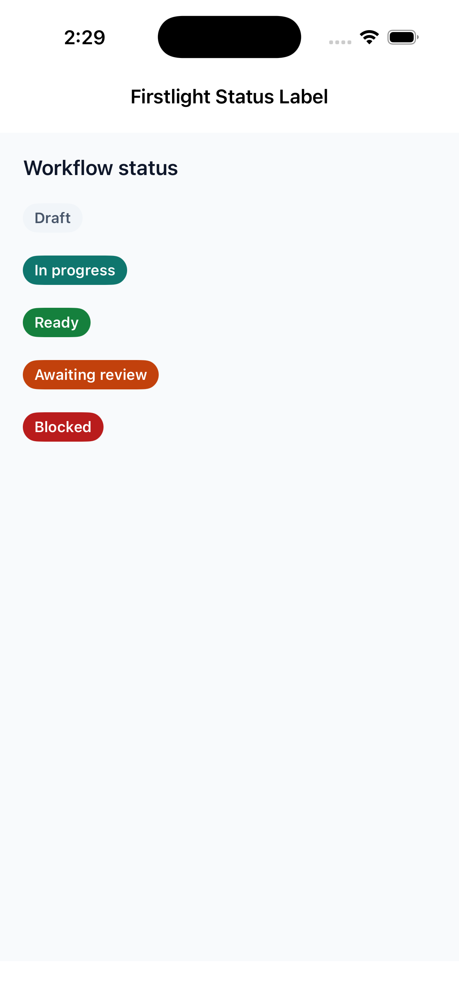
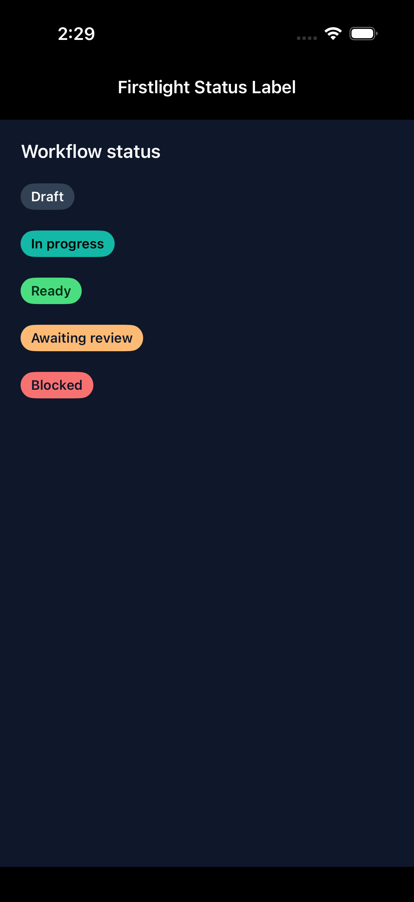
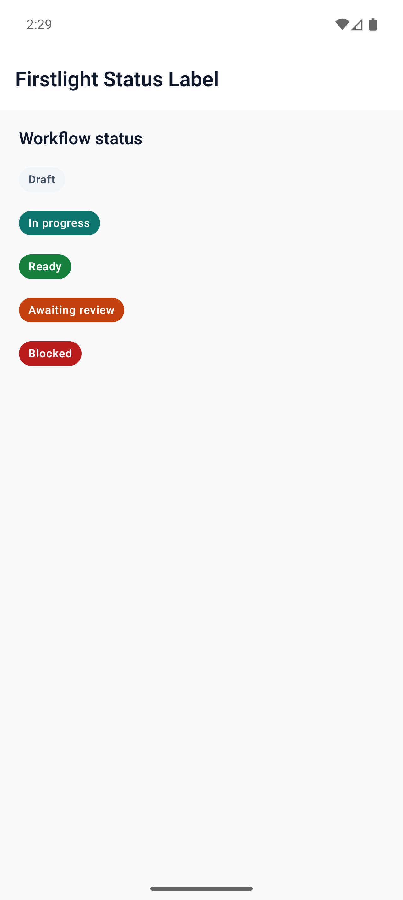
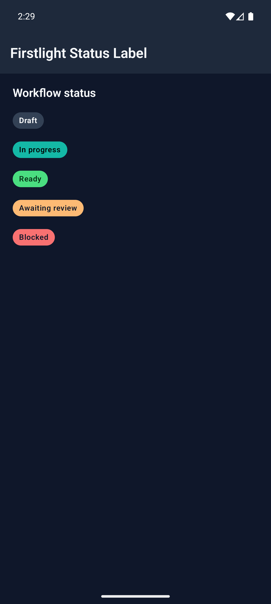

# Status Label

Status Label presents short display-only metadata or status text as a native capsule. Use an interactive choice component such as Pill Group when the capsule must respond to a press.

## Complete example

```blade
<firstlight:status-label
    label="Awaiting review"
    tone="warning"
    a11y-label="Referral status: awaiting review"
    a11y-hint="Updated by the referrals team"
/>
```

The same authored tag renders on iOS and Android.

## Props

| API | Accepted type | Purpose |
| --- | --- | --- |
| `label` | non-empty `string` | Visible status text. Required. |
| `tone` | `neutral`, `info`, `success`, `warning`, or `danger` | Semantic colour intent. Defaults to `neutral`. |
| `a11y-label` | `string` | Replaces the visible text as the accessible name. |
| `a11y-hint` | `string` | Adds supplementary VoiceOver or TalkBack context. |
| `class` | `string` | External EDGE layout utilities. |

## Events and values

Status Label has no value, options, model binding, or events. It is static text from the user's perspective. A later server publication may replace its label, tone, or accessibility metadata without producing a callback.

Do not use `native:model`, `@change`, `@press`, `value`, `disabled`, `loading`, `error`, `required`, or `helper`. Firstlight rejects those attributes instead of silently adding interactive or field semantics.

## State timing

The component renders the latest published Element Tree metadata. It keeps no native selection, editing buffer, pending proposal, or animation state. Programmatic updates reconcile by the element's stable node ID and do not emit events.

## Disabled, loading, and error behaviour

Disabled, loading, and validation states do not apply to display-only status text. Choose the semantic `tone` that describes the current metadata and publish a new label or tone when that status changes.

## Accessibility

The visible `label` is the accessible name by default. `a11y-label` replaces that name, and `a11y-hint` adds context. Both renderers expose static text semantics without a button, selected, disabled, or live-region role.

Text follows Dynamic Type on iOS and system font scaling on Android. Long labels and accessibility sizes expand or wrap rather than truncating their meaning. Semantic theme colours are checked at render time; when a customised foreground and background are below 4.5:1 contrast, Firstlight uses whichever of black or white has the stronger ratio.

## Validation and failure behaviour

A missing, `null`, empty, or whitespace-only `label` throws an `InvalidArgumentException`. An unsupported tone also throws and lists the accepted values. Malformed tone data that reaches a native renderer unexpectedly falls back defensively to `neutral` instead of crashing the host.

## Platform behaviour

iOS composes SwiftUI `Text` with a `Capsule` background and native text accessibility. Android composes Material 3 `Text` in a capsule-shaped `Surface` with merged TalkBack semantics. Both use NativePHP semantic theme tokens while retaining platform-native typography, scaling, colour-scheme, and layout behaviour.

## Compatibility

Status Label supports the versions listed in the current [compatibility reference](../reference/compatibility.md) and requires both native renderers to be compiled into the host application.

## Screenshots

| Platform | Light | Dark |
| --- | --- | --- |
| iOS |  |  |
| Android |  |  |
