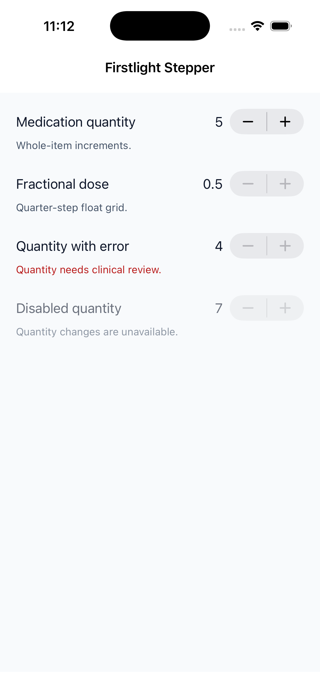
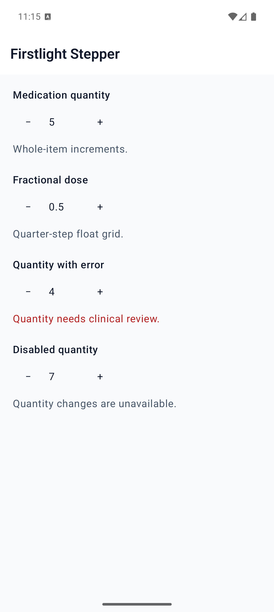
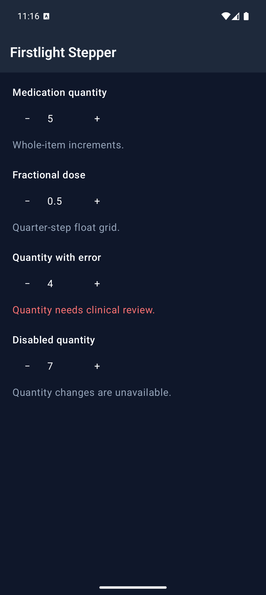

# Stepper

Stepper moves a numeric model by one bounded step at a time. PHP remains the
accepted source of truth: a tap proposes the adjacent value and the native
control continues showing the accepted value until PHP publishes again.

```blade
<firstlight:stepper
    native:model="quantity"
    :min="0"
    :max="10"
    :step="1"
    label="Quantity"
    helper="Adjust one item at a time"
/>
```

Use Blade's `:` binding for numbers. Literal HTML attributes such as `min="0"`
are strings and are rejected deliberately.

## Props

| API | Accepted type | Purpose |
| --- | --- | --- |
| `value` / `native:model` | finite `int|float` | Required accepted value. |
| `min` | finite `int|float` | Required inclusive lower bound. |
| `max` | finite `int|float` | Required inclusive upper bound. |
| `step` | finite positive `int|float` | Grid spacing from `min`; defaults to integer `1`. |
| `label` | `string` | Visible field label and accessible-name fallback. |
| `helper` | `string` | Supporting guidance below the control. |
| `error` | `string` | Validation feedback that replaces helper text. |
| `disabled` | `bool` | Prevents decrement and increment proposals. |
| `a11y-label` | `string` | Explicit accessible name when no visible label is appropriate. |
| `a11y-hint` | `string` | Additional VoiceOver and TalkBack guidance. |
| `class` | `string` | External EDGE layout for the complete field. |

`min` must be less than `max`. The accepted value must be within the inclusive
bounds, and both it and `max` must lie on the `step` grid originating at `min`.
Numeric strings, booleans, null, non-finite values, native Float overflow,
off-grid values, and grids larger than the signed 32-bit interval limit are
rejected. Values are never clamped or coerced.

## Exact PHP number types

Stepper preserves intentional PHP number kinds. If `value`, `min`, `max`, and
`step` are all integers, proposals are integers. If any one is a float, all
numeric tree props and proposals are floats, even an integral value such as
`5.0`. An omitted step defaults to integer `1` for an otherwise integer model.

```php
public int $quantity = 5;
public float $dose = 5.0;
```

Decimal grid comparisons tolerate only normal binary floating-point noise such
as `0.1 + 0.2`; the public value still has to be on the authored grid.

## Events and server authority

Use `@change`, plain `native:model`, or `native:model.live`. A decrement or
increment sends one adjacent precomputed value through the standard callback.
Blur and debounce modes are rejected because a step is already an immediate,
discrete action.

After a proposal, another tap is ignored until the server publishes the node
again. This prevents stale rapid taps from calculating against an old accepted
value. The control does not change optimistically and performs no arithmetic on
the device.

NativePHP Mobile 4.2.0 still needs a content-independent publication
acknowledgement from the bundled PHP runtime when PHP rejects a proposal and
republishes an identical accepted value. Stepper remains release-blocked on
that upstream behaviour ([#365](https://github.com/NativePHP/mobile-air/issues/365));
accepted changes already reconcile normally.

## Accessibility and platform behavior

Contract exceptions still reject invalid numeric grids before publication.
User validation is separate: screens that `use ValidatesFields` auto-bind the
first MessageBag message for the field's `native:model` or `error-for` name.
An authored `error` wins. See [Validate fields](../how-to/validate-fields.md).

Provide a visible `label` or an explicit `a11y-label`. VoiceOver and TalkBack
receive the accepted value, hint, helper or error, disabled state, and named
decrease/increase actions. At a boundary, only the unavailable direction is
disabled.

iOS uses the genuine SwiftUI Stepper. Android uses Material 3 icon buttons in
the idiomatic minus/value/plus arrangement. Stepper deliberately has no custom
icons, formatter, min/max captions, wraparound, orientation, long-press
acceleration, required state, size, variant, colour, or style escape props.

## Screenshots

| Platform | Light | Dark |
| --- | --- | --- |
| iOS |  |  |
| Android |  |  |
