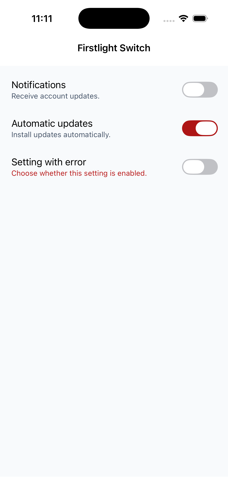
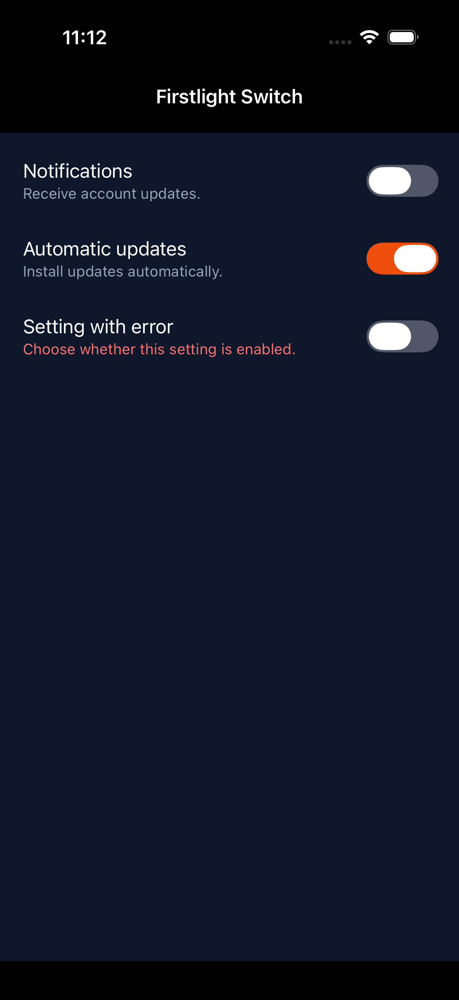
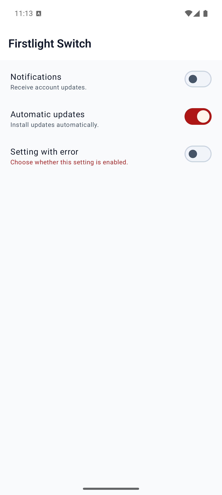
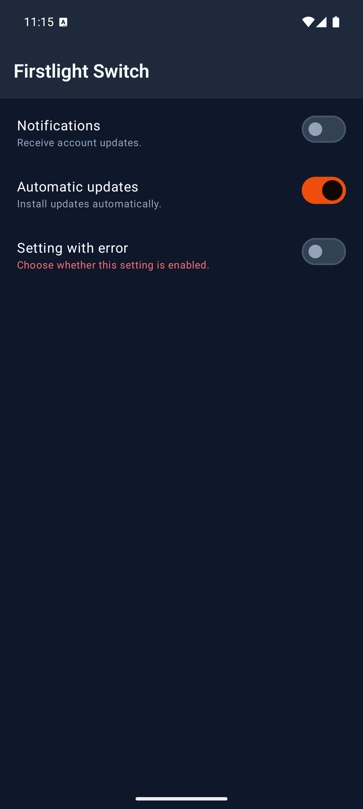

# Switch

Switch presents one boolean setting as a native on/off control.

## Complete example

Declare a boolean property on the native component, then bind it with `native:model`:

```php
<?php

namespace App\NativeComponents;

use Illuminate\View\View;
use Native\Mobile\Edge\NativeComponent;

class NotificationSettings extends NativeComponent
{
    public bool $notifications = false;

    public function render(): View
    {
        return view('native.notification-settings');
    }
}
```

```blade
<firstlight:switch
    native:model="notifications"
    label="Notifications"
    helper="Receive account updates."
    a11y-hint="Controls notification delivery"
/>
```

## Props

| API | Accepted type | Purpose |
| --- | --- | --- |
| `value` | `bool` | Accepted value. Defaults to `false` when omitted. |
| `native:model` | a boolean component property | Synchronises the accepted boolean value through NativePHP. `native:model.live` is also accepted. |
| `label` | `string` | Visible setting label. |
| `helper` | `string` | Supporting text below the setting. |
| `error` | `string` | Error text and error semantics; shown instead of `helper` when non-empty. |
| `disabled` | `bool` | Prevents interaction and change events. |
| `a11y-label` | `string` | Explicit accessibility label when a visible label is inappropriate. |
| `a11y-hint` | `string` | Additional VoiceOver and TalkBack guidance. |
| `class` | `string` | External EDGE layout utilities. |

## Events

`@change` receives the proposed boolean value. Use it when the server decides whether to accept a change:

```php
public bool $notifications = false;

public function updateNotifications(bool $value): void
{
    $this->notifications = $value;
}
```

```blade
<firstlight:switch
    :value="$notifications"
    @change="updateNotifications"
    label="Notifications"
/>
```

`native:model` normally supplies the same callback for property synchronisation.

## Accepted values

Switch accepts only strict PHP booleans: `true` and `false`. Bind a literal Boolean with `:`:

```blade
<firstlight:switch :value="false" label="Notifications" />
```

`value="false"` is invalid because Blade passes it as a string. `null`, integers, string booleans, arrays, and objects are also rejected.

## State timing

Switch is [server-authoritative](../concepts/server-authoritative-state.md). A native interaction immediately emits its proposed Boolean, but the visible on/off state remains the last value published by PHP. A response that accepts the proposal changes the visible state; a response that rejects it leaves the visible state unchanged. Every server publication clears a pending proposal, including one that republishes the same value. Programmatic publications update the accepted state without emitting `@change`.

Use `native:model` or `native:model.live`. Deferred `blur`, `lazy`, and `debounce` sync modes are rejected.

## Disabled behaviour

When `disabled` is `true`, Switch stays visible with its accepted on/off state and cannot emit a proposal or `@change` event.

## Accessibility

Provide a visible `label` or an explicit `a11y-label`; Firstlight warns during development when both are blank. The native controls expose the setting name, on/off value, disabled state, optional hint, and error semantics. SwiftUI provides a minimum 44-point target; the Material 3 row provides a minimum 48-dp target and one TalkBack switch focus stop.

## Validation and failure behaviour

Contract exceptions still reject non-Boolean values, unsupported `required` or
`placement`, and deferred sync modes before publication. User validation is
separate: screens that `use ValidatesFields` auto-bind the first MessageBag
message for the field's `native:model` or `error-for` name. An authored
`error` wins. See [Validate fields](../how-to/validate-fields.md). An error
takes precedence over helper text and is included in accessibility semantics.

## Platform behaviour

iOS uses a genuine SwiftUI `Toggle` with the native switch style and system motion. Android uses a genuine Material 3 `Switch` inside a row-owned switch semantic target, preserving Material state layers and TalkBack behaviour. The public EDGE API and server-authoritative state contract are shared; native geometry, presentation, and interaction remain platform-specific.

## Compatibility

Switch supports the versions listed in the current [compatibility reference](../reference/compatibility.md) and requires both native renderers to be compiled into the host application.

## Screenshots

| Platform | Light | Dark |
| --- | --- | --- |
| iOS |  |  |
| Android |  |  |
