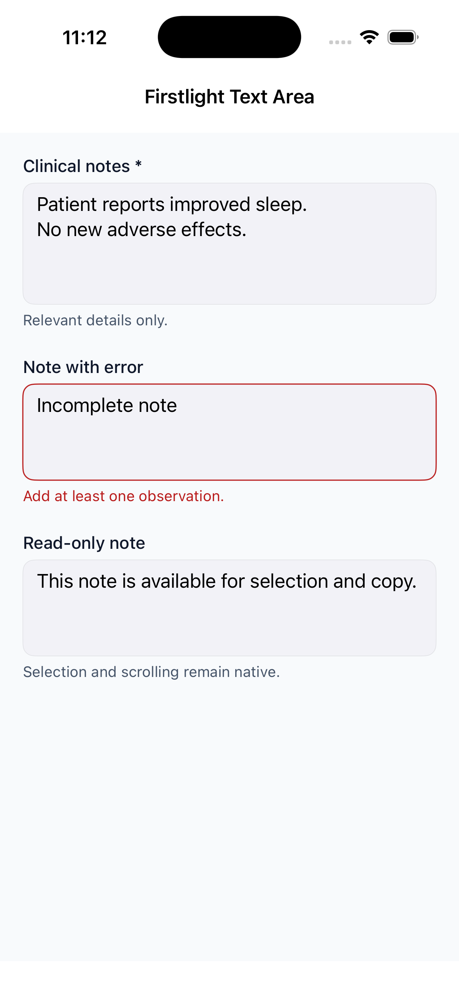
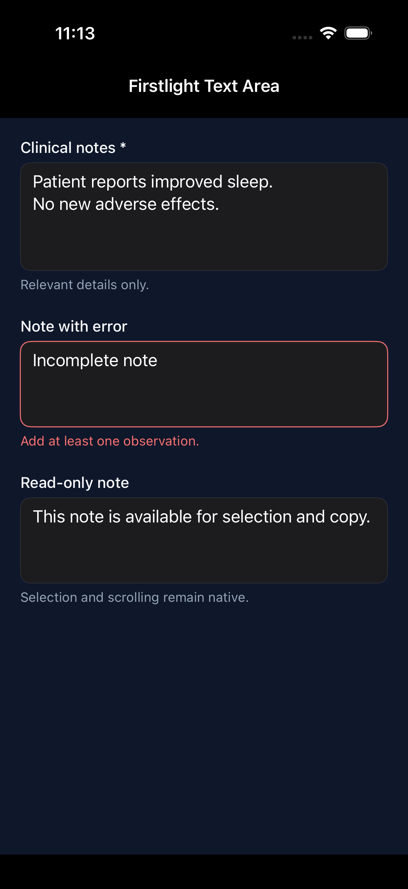
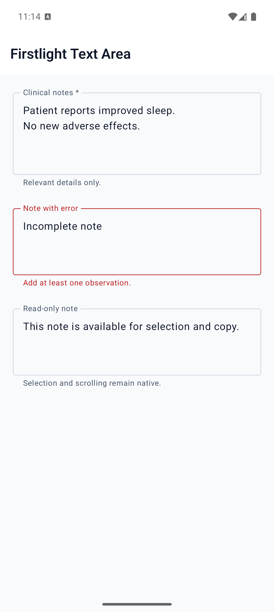
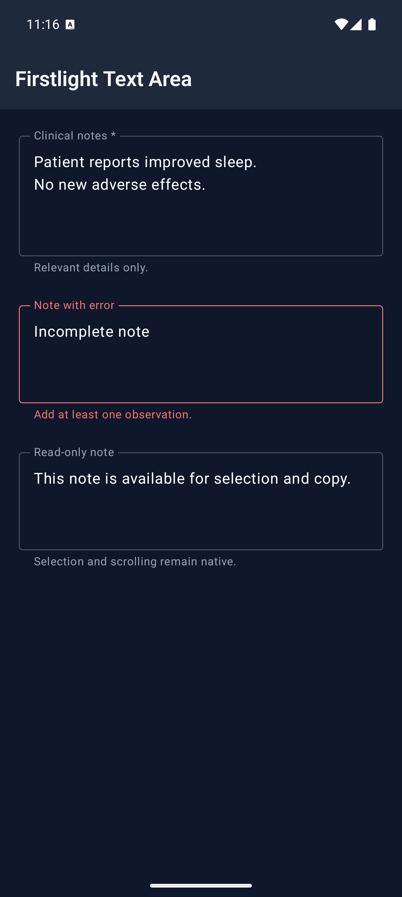

# Text Area

Text Area enters and edits plain multiline text using each platform's native
selection, composition, focus, scrolling, autocapitalization, and autocorrection
behaviour.

## Complete example

```blade
<firstlight:text-area
    label="Clinical notes"
    placeholder="Add relevant history and observations"
    helper="Do not include information that is not required."
    :required="true"
    :min-lines="4"
    :max-lines="10"
    autocapitalize="sentences"
    native:model.debounce.500ms="notes"
/>
```

## Props

| API | Accepted type | Purpose |
| --- | --- | --- |
| `value` / `native:model` | `string` | Published PHP value; omission defaults to `''`. |
| `label` | `string` | Visible label and accessibility-name fallback. |
| `placeholder` | `string` | Short empty-state guidance; never replaces a label. |
| `helper` | `string` | Supporting guidance below the field. |
| `error` | `string` | Validation feedback that replaces helper text. |
| `required` | `bool` | Communicates required metadata without performing validation. |
| `disabled` | `bool` | Prevents focus and editing. |
| `read-only` | `bool` | Keeps native selection, copy, and scrolling while preventing edits. |
| `min-lines` | positive `int` | Minimum visible lines; defaults to `3`. |
| `max-lines` | positive `int` | Maximum visible lines before native scrolling; defaults to `8`. |
| `autocapitalize` | enum string | `none`, `sentences`, `words`, or `characters`; omission keeps platform policy. |
| `autocorrect` | `bool` | Explicitly enables or disables platform autocorrection. |
| `a11y-label` | `string` | Explicit accessible name when no visible label is appropriate. |
| `a11y-hint` | `string` | Additional VoiceOver or TalkBack guidance. |
| `class` | `string` | External EDGE layout for the complete field. |

`max-lines` must be greater than or equal to `min-lines`. Public Blade examples
use kebab-case. The PHP element also accepts `minLines`, `maxLines`, and
`readOnly` aliases.

## Events and synchronisation

`@change` receives the complete current string, including newline characters.
Plain `native:model` and `.live` publish while editing. `.blur` and `.lazy`
publish on focus loss. `.debounce.500ms` publishes after the quiet period and
flushes on blur. Durations below 50 milliseconds are rejected.

Typing, selection, cursor position, marked text or IME composition, focus,
keyboard, and scroll position remain native while focused. PHP acknowledgements
therefore do not replace the active buffer. Different server publications wait
for safe reconciliation, while unfocused programmatic updates replace the
displayed string without emitting `@change`.

Text Area intentionally has no `@submit`, `@press`, icons, secure mode,
single-line keyboard or content hints, clear/reveal affordances, loading state,
prefix, suffix, or styling escape props.

## Validation and accessibility

Values and textual metadata are strict strings. Boolean flags require real
booleans. Line counts require positive integers, the range must be ordered,
and invalid capitalization or sync modes fail with actionable exceptions.

A visible `label` or explicit `a11y-label` is required during development.
Error text replaces helper text while preserving the current accessible name
and value. Disabled and read-only states remain distinct. Native type scaling,
light and dark appearance, increased contrast, Reduced Motion, and RTL remain
platform-owned.

## Platform behaviour

iOS uses a genuine SwiftUI `TextEditor` in Apple-native field composition.
Android uses Material 3 `OutlinedTextField` with `TextFieldValue`, multiline
line bounds, supporting and error slots, and Compose selection and composition.

## Screenshots

| Platform | Light | Dark |
| --- | --- | --- |
| iOS |  |  |
| Android |  |  |
