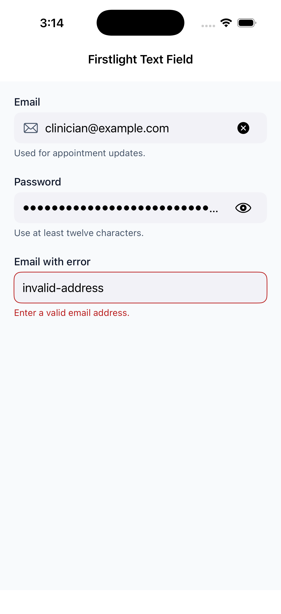
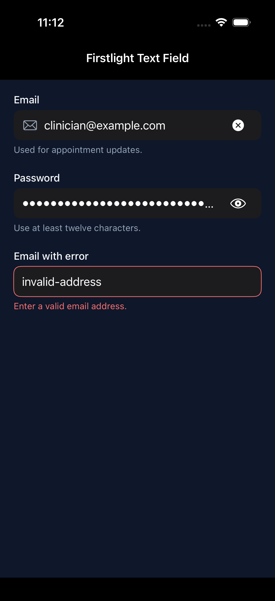
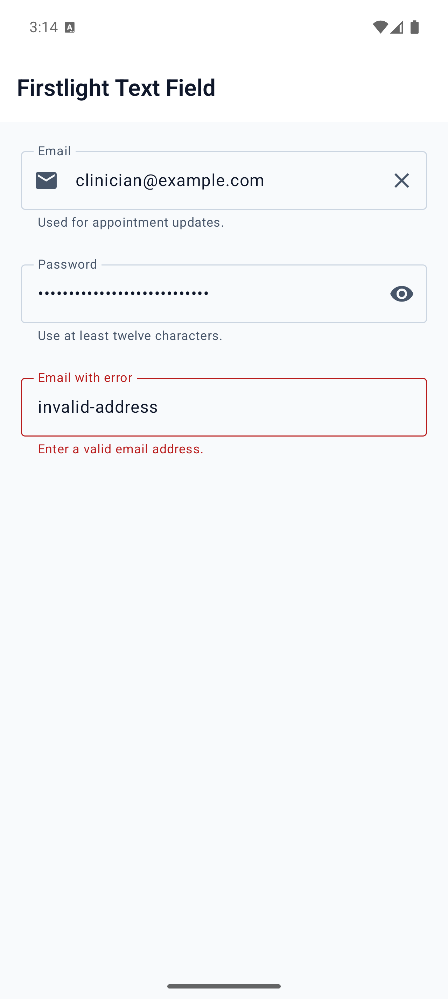
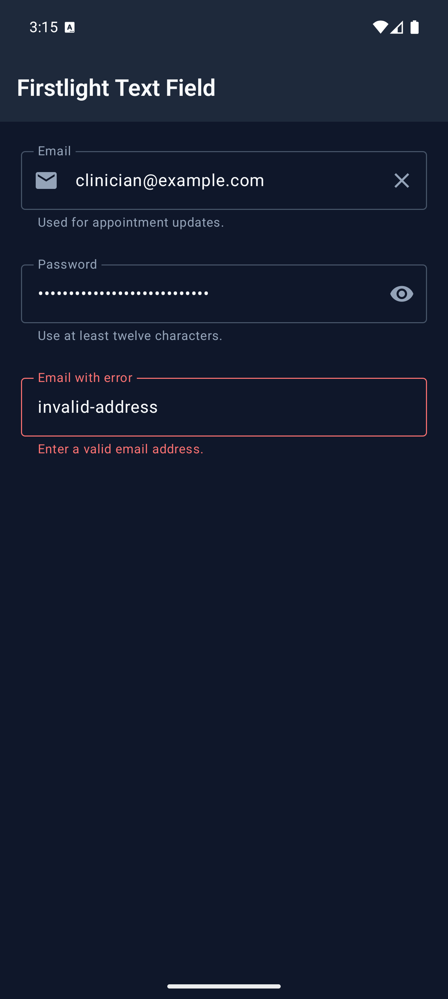

# Text Field

Text Field enters and edits one line of text using the native field, keyboard,
autofill, selection, and accessibility behaviour of each platform.

## Complete example

```blade
<firstlight:text-field
    label="Email"
    placeholder="you@example.com"
    helper="Used for appointment updates."
    keyboard="email"
    content-type="email"
    autocapitalize="none"
    :autocorrect="false"
    clearable
    native:model.blur="email"
/>
```

## Props

| API | Accepted type | Purpose |
| --- | --- | --- |
| `value` / `native:model` | `string` | Published PHP value; omission defaults to `''`. |
| `label` | `string` | Visible label and accessibility-name fallback. |
| `placeholder` | `string` | Short example; never a replacement for a label. |
| `helper` | `string` | Supporting guidance below the field. |
| `error` | `string` | Validation feedback that replaces helper text. |
| `required` | `bool` | Communicates required metadata without performing validation. |
| `disabled` | `bool` | Prevents focus, editing, and every action. |
| `read-only` | `bool` | Allows native selection and copy while preventing edits and changes. |
| `keyboard` | enum string | `text`, `email`, `phone`, `url`, `number`, or `decimal`. |
| `content-type` | enum string | `name`, `username`, `email`, `password`, `new-password`, or `one-time-code`. |
| `secure` | `bool` | Masks display without changing the stored string. |
| `autocapitalize` | enum string | `none`, `sentences`, `words`, or `characters`; omission keeps platform policy. |
| `autocorrect` | `bool` | Explicitly enables or disables platform autocorrection. |
| `submit-label` | enum string | `done`, `go`, `next`, `search`, or `send`; omission keeps the platform default. |
| `leading-icon` | `string` | Shared decorative leading icon fallback. |
| `leading-icon-ios` | `IosSymbol|string` | iOS leading icon override. |
| `leading-icon-android` | `AndroidSymbol|string` | Android leading icon and variant override. |
| `trailing-icon` | `string` | Shared decorative or authored-action icon fallback. |
| `trailing-icon-ios` | `IosSymbol|string` | iOS trailing icon override. |
| `trailing-icon-android` | `AndroidSymbol|string` | Android trailing icon and variant override. |
| `trailing-a11y-label` | `string` | Required accessible name when `trailing-icon` has `@press`. |
| `clearable` | `bool` | Adds a native clear action while editable text is non-empty. |
| `revealable` | `bool` | Adds native show/hide password state; requires `secure`. |
| `a11y-label` | `string` | Explicit accessible name when no visible label is appropriate. |
| `a11y-hint` | `string` | Additional VoiceOver and TalkBack guidance. |
| `class` | `string` | External EDGE layout for the complete field. |

## Events and synchronisation

`@change` receives the current string. `@submit` flushes any pending change,
then receives the same current string. An authored interactive trailing icon
uses standard `@press` and receives no text argument.

Plain `native:model` and `.live` publish while editing. `.blur` and `.lazy`
publish on focus loss or submit. `.debounce.500ms` publishes after the quiet
period and flushes on blur or submit; durations below 50 ms are rejected.
Native typing, selection, cursor position, and marked-text composition remain
local while focused so PHP acknowledgements do not cause keyboard jumps.

## Icons and trailing actions

The shared icon is the fallback; the active platform override wins. Blade uses
the exact `-ios` and `-android` suffixes above, and typed Android symbols retain
their filled or outlined variant on the wire. Decorative icons are silent.

An authored trailing action requires all of `trailing-icon`,
`trailing-a11y-label`, and `@press`. `clearable` and `revealable` instead own
their platform-native icon and localized accessibility state. These semantic
actions are mutually exclusive and cannot share the trailing slot with an
authored action.

Clearing retains focus and immediately publishes `''` through `@change`, even
under blur or debounce sync. Revealing changes presentation only and never
publishes the password value.

## Validation and accessibility

Values and textual attributes are strict strings. Invalid enum values,
incomplete trailing actions, conflicting affordances, `revealable` without
`secure`, and debounce durations below 50 ms fail with actionable exceptions.
A visible `label` or explicit `a11y-label` is required during development.

Error text replaces helper text without replacing the field's accessible name
or value. Decorative icons stay hidden from assistive technology. Icon actions
are separate native accessibility nodes with a minimum 44-point target on iOS
and 48-dp target on Android.

## Platform behaviour

iOS uses an Apple SwiftUI `TextField` or `SecureField` composition with system
field treatment, SF Symbols, Dynamic Type, native keyboard and autofill hints,
and Apple spacing. Android uses Material 3 `OutlinedTextField`, Material label
and supporting/error slots, `TextFieldValue` selection and composition,
keyboard/IME options, and Compose autofill content types.

## Screenshots

| Platform | Light | Dark |
| --- | --- | --- |
| iOS |  |  |
| Android |  |  |
