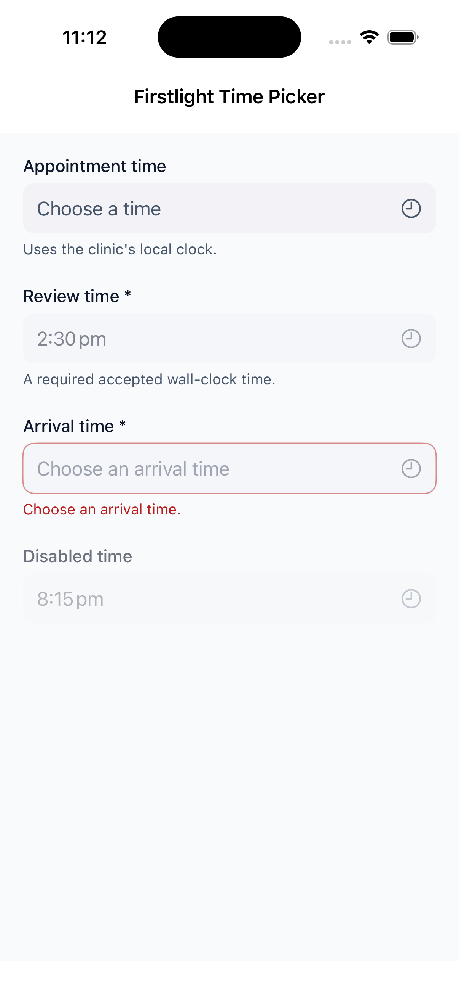
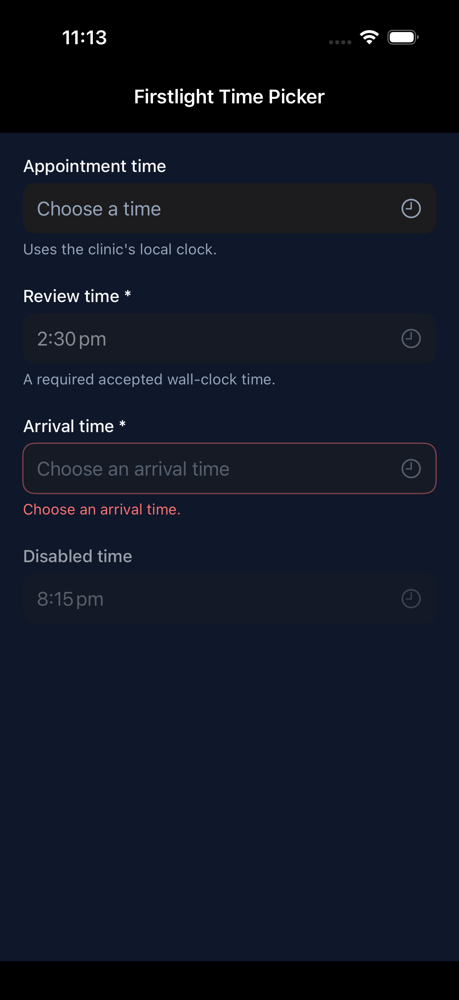
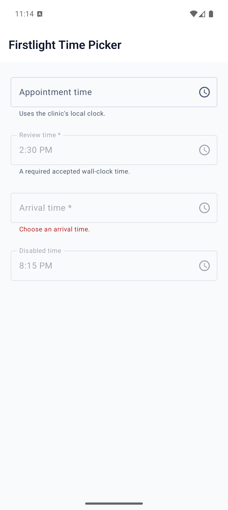

# Time Picker

Time Picker chooses an optional wall-clock time using the platform's native
time control. The model value is always exact 24-hour `HH:mm` or `null`, even
when the platform displays a localized 12-hour clock.

```blade
<firstlight:time-picker
    native:model="appointmentTime"
    label="Appointment time"
    placeholder="Choose a time"
    helper="Clinic local time"
    locale="en-AU"
    timezone="Australia/Sydney"
/>
```

The user edits a temporary native draft. Cancel discards it and Confirm sends
`@change`; the closed trigger continues to show the server-accepted value
until PHP republishes the tree.

## Values and props

- `value` / `native:model`: exact `HH:mm` or `null`.
- `label`, `placeholder`, `helper`, and `error`: field copy.
- `required` and `disabled`: field state.
- `locale`: BCP-47 tag used only for display.
- `timezone`: IANA identifier used only to seed a null draft with the current
  local minute.
- `a11y-label` and `a11y-hint`: explicit accessibility copy.
- `class`: external EDGE layout.

Use plain `native:model` or `native:model.live`. Time Picker commits only on
confirmation, so blur, lazy, and debounce modes are rejected. It deliberately
does not expose min/max, seconds, steps, ranges, hour-format overrides,
presentation styles, clear affordances, read-only state, icons, or colours.

## Validation and accessibility

Firstlight does not trim or coerce time values. For example, `09:05` is valid;
`9:05`, `09:05:00`, `24:00`, and whitespace-padded values are not.

Always provide either a visible `label` or `a11y-label`. Errors replace helper
text visually and are announced by platform semantics. The native presentation
retains standard VoiceOver or TalkBack traversal and Cancel/Confirm actions.

## Screenshots

| Platform | Light | Dark |
| --- | --- | --- |
| iOS |  |  |
| Android |  |  |
