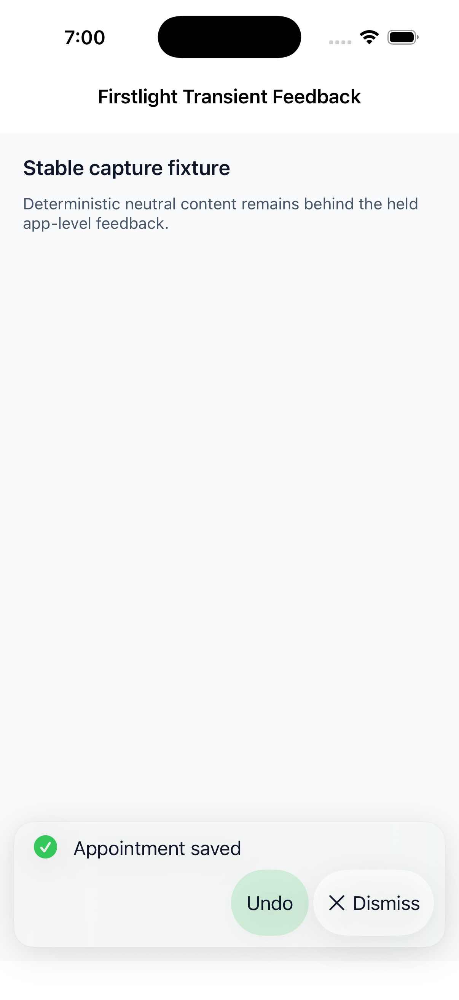
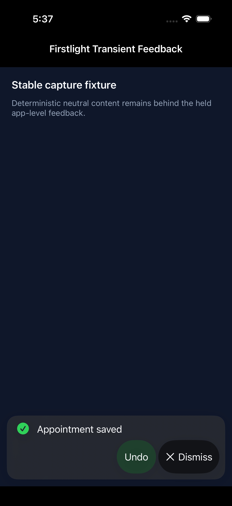
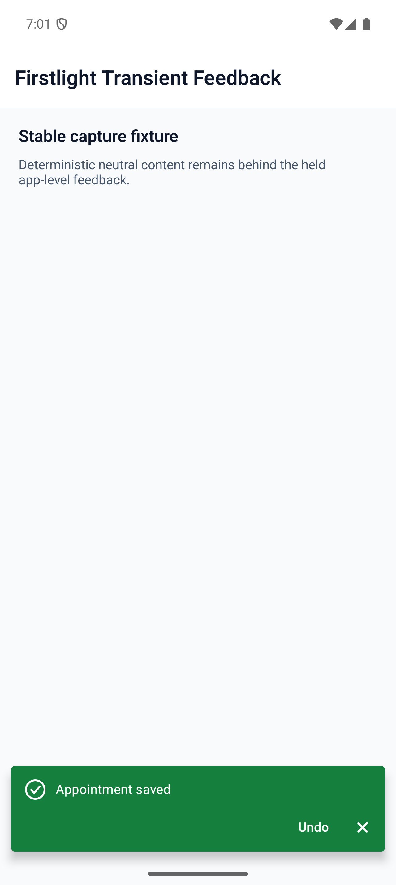
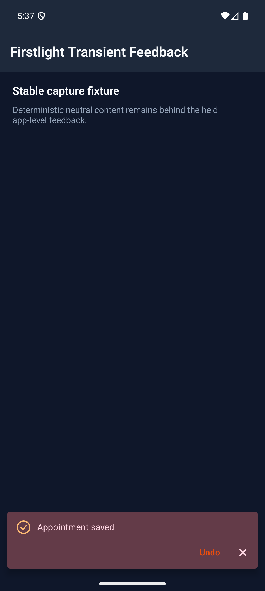

# Transient Feedback

```php
use FirstlightUI\Facades\Feedback;

$feedbackId = Feedback::success('Appointment saved')
    ->action('Undo', 'undo-save')
    ->send();
```

This publishes one app-level native message and returns its stable string ID. There is no Blade tag and no host installation step: installing Firstlight registers the package-owned feedback host automatically.

Transient Feedback is for brief outcomes that may cross screen navigation. Use [Callout](callout.md) for persistent content in the authored layout and [Confirmation Dialog](confirmation-dialog.md) when work must pause for a decision.

## Factories and builder

The public identity is `FirstlightUI\Facades\Feedback`.

| API | Return | Contract |
| --- | --- | --- |
| `Feedback::message(string $message)` | `PendingFeedback` | Creates default-tone feedback. |
| `Feedback::success(string $message)` | `PendingFeedback` | Creates success feedback. |
| `Feedback::warning(string $message)` | `PendingFeedback` | Creates warning feedback. |
| `Feedback::danger(string $message)` | `PendingFeedback` | Creates danger feedback. |
| `->id(string $id)` | new `PendingFeedback` | Uses an application-owned stable ID. |
| `->action(string $label, string $key)` | new `PendingFeedback` | Adds one visible labelled action and its application key. |
| `->hold()` | new `PendingFeedback` | Keeps the item until action, manual dismissal, or programmatic removal. |
| `->send()` | `string` | Publishes the item and returns its authored or generated ID. |
| `Feedback::dismiss(string $id)` | `bool` | Removes a pending or visible item; returns whether it existed. |

The builder is immutable. Calling a modifier returns a new builder and does not change the instance it was called on. When `id()` is omitted, `send()` generates a UUID string.

## Tones

The four factories are the complete tone API:

- `message()` uses `default` for neutral application information.
- `success()` communicates a completed outcome.
- `warning()` communicates a recoverable risk or interruption.
- `danger()` communicates a failed or destructive outcome.

Tone controls native colour and a decorative semantic symbol. It does not change queue, timing, or event behaviour.

## Application events

Register normal Laravel listeners in a service provider when the application needs to react to user outcomes:

```php
use FirstlightUI\Events\FeedbackActionPressed;
use FirstlightUI\Events\FeedbackDismissed;
use Illuminate\Support\Facades\Event;

public function boot(): void
{
    Event::listen(function (FeedbackActionPressed $event): void {
        // $event->id and $event->actionKey
    });

    Event::listen(function (FeedbackDismissed $event): void {
        // $event->id and $event->reason
    });
}
```

`FeedbackActionPressed` has public readonly `string $id` and `string $actionKey` properties. `FeedbackDismissed` has public readonly `string $id` and `FeedbackDismissReason $reason`. The dismissal reasons are `Timeout`, `Manual`, and `Action`, with wire values `timeout`, `manual`, and `action`.

Pressing an action removes the item, dispatches `FeedbackActionPressed`, then dispatches `FeedbackDismissed` with `FeedbackDismissReason::Action`. The dismissal event is still dispatched if an action listener throws, and the listener exception is not swallowed. An automatic timeout dispatches only `FeedbackDismissed` with `FeedbackDismissReason::Timeout`. A manual native dismissal dispatches only `FeedbackDismissed` with `FeedbackDismissReason::Manual`.

`Feedback::dismiss($id)` is programmatic reconciliation. It dispatches neither event, including when it removes the visible item.

## Queue and stable-ID updates

Feedback is displayed one item at a time in first-in, first-out order. Sending a new ID appends it. Sending an existing ID replaces that semantic record in place, so it keeps its current queue position:

```php
Feedback::message('Connecting')->id('connection')->send();
Feedback::warning('Connection interrupted')->id('connection')->hold()->send();
```

An update can change message, tone, action, and held state. Updating the visible ID does not restart elapsed automatic time; the native host recalculates the allowed duration from the current content and accessibility policy. Completed IDs are protected from stale native frames and cannot dismiss or act on the next item.

Use a stable authored ID when later code must update or remove an item. Use the generated ID returned by `send()` for one-off feedback.

## Lifetime and dismissal

Automatic feedback starts with a four-second minimum. Longer text may increase message time up to ten seconds, and an action adds two seconds. Platform accessibility policy may extend that duration. Automatic feedback has no visible dismiss control.

`hold()` disables automatic timeout. A held item presents an explicit native dismiss control with the accessible label `Dismiss feedback`; its optional application action remains available. Either user action advances the queue. `Feedback::dismiss()` removes held and automatic items alike without an application event.

There is no public duration, position, animation, swipe, close-label, or stacking option.

## Navigation, background, and process lifecycle

The feedback store and native host belong to the installed package, not the screen that called the facade. Pending and visible items therefore survive normal NativePHP screen navigation. Each publication refreshes package-owned native callback IDs, so an outcome routes to the feedback service rather than to a screen that has been replaced.

Automatic time counts only while the app is active and its feedback controls do not hold accessibility focus. Moving the app to the background pauses the remaining duration; returning to the foreground resumes it. Held items do not accrue timeout time.

The store is process-local memory. Process termination clears the queue; Transient Feedback is not durable storage and does not restore messages after relaunch.

## Accessibility

Each newly visible semantic ID is announced once. Updating the same ID changes the visible content without repeating the announcement. Tone symbols are hidden from VoiceOver and TalkBack, while message text and labelled actions retain native semantics.

Actions meet the platform baseline of at least 44 points on iOS and 48 dp on Android. Long text wraps, controls reflow under constrained width or large text, and both platforms preserve dark mode, contrast, and right-to-left layout. Automatic timing pauses while an action owns accessibility focus.

iOS doubles the automatic duration while VoiceOver or Switch Control is active and uses an opacity-only transition with Reduce Motion. Android passes the content type and base duration to `AccessibilityManager.getRecommendedTimeoutMillis`, available at the package's API 29 floor, and retains Material snackbar accessibility semantics.

## Validation and failure behaviour

Messages passed to a factory and values passed to `id()` or `action()` must be non-empty after trimming. Invalid values throw `InvalidArgumentException` before publication; surrounding non-blank whitespace is preserved. The action label and key are always authored together through `action()`. `Feedback::dismiss()` returns `false` for an unknown ID, including a blank ID, rather than publishing an event.

Defensive native decoding treats incomplete native action metadata as no action; an otherwise eligible item remains visible without an action. Blank or invalid identity, message, or tone, duplicate IDs in one frame, and a missing required lifetime callback make an item ineligible. Repeated or stale callbacks produce no duplicate events.

Disabled, loading, model binding, rich content, multiple actions, icons, per-platform copy, arbitrary colours, and renderer-specific styling do not apply. There is no consumer-authored feedback-center host and no supported direct construction of the internal wire elements.

## Platform behaviour

iOS presents a bottom SwiftUI material notice with semantic SF Symbols, native buttons, safe-area spacing, Dynamic Type, and a reduced-motion-aware transition. Android presents a bottom Material 3 `Snackbar` with semantic tone treatment, navigation-bar and IME padding, responsive action layout, and TalkBack live-region behaviour.

Both platforms own one visible item and the same FIFO/event contract. Native expression differs by platform; Firstlight guarantees behavioural parity rather than identical geometry.

## Compatibility

Transient Feedback supports the package versions and platform floors in the current [compatibility reference](../reference/compatibility.md): PHP 8.4, NativePHP Mobile 4, NativePHP Mobile UI 0.3, iOS 18 or later, and Android API 29 or later. Both Firstlight native hosts must be compiled into the application.

## Screenshots

The screenshot manifest reserves `/captures/transient-feedback` and the four paths below. `bin/check-transient-feedback --development` reports missing showcase, image, and review evidence without blocking documentation work. Release mode requires a sibling showcase (or `--showcase=PATH`) with that exact route and `tests/Feature/TransientFeedbackCaptureTest.php`, valid differentiated PNGs, and a current `spec/reviews/transient-feedback-alpha.md` containing exact revisions, affirmative visual approval, and PASS rows for the screenshot, platform, accessibility, lifecycle, and physical-device evidence.

| Platform | Light | Dark |
| --- | --- | --- |
| iOS |  |  |
| Android |  |  |
