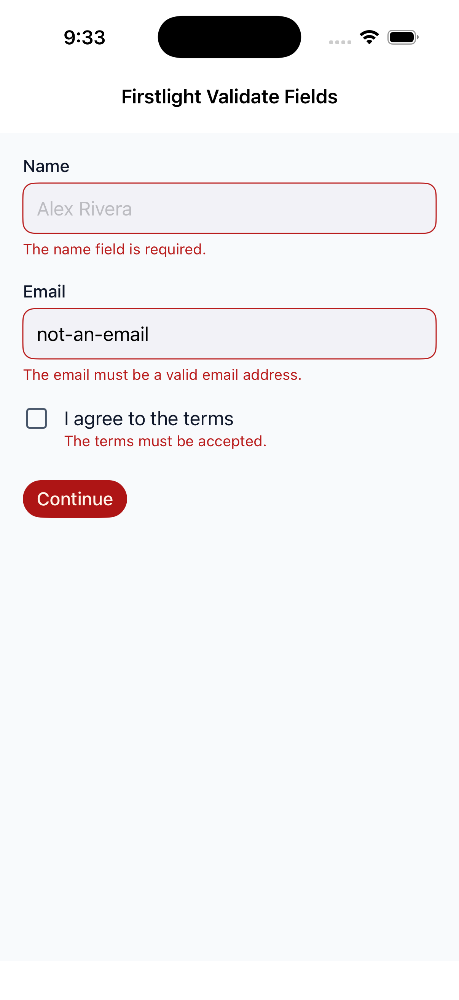
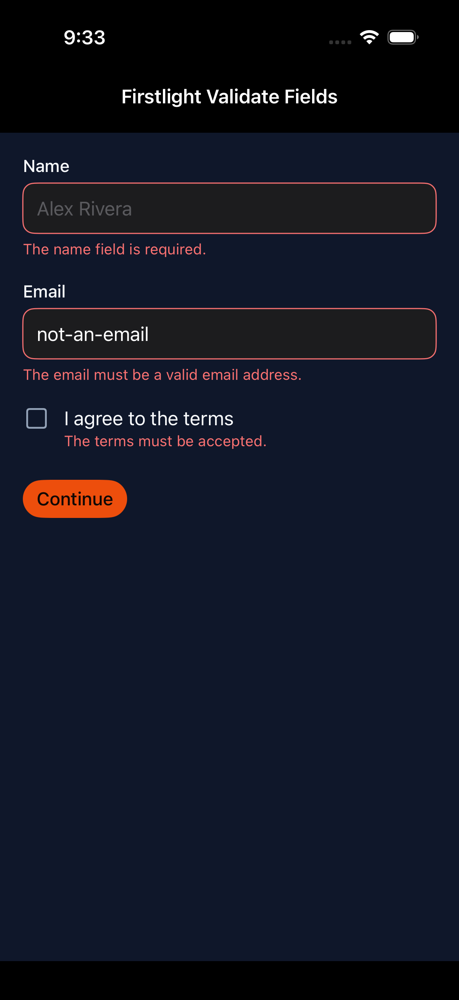
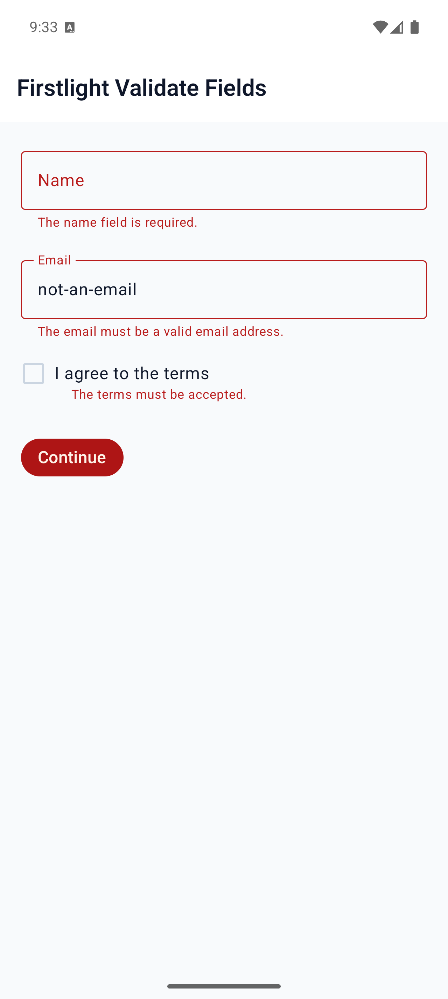
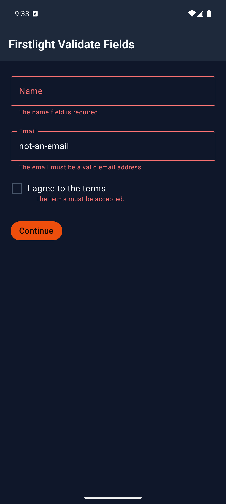

# Validate Firstlight Fields

NativePHP EDGE has no built-in `validate()`. Firstlight adds a Livewire-shaped
Laravel Validator layer. A screen that opts in can call `$this->validate()` or
`$this->validateOnly()`, and participating fields show the first `MessageBag`
message in the native `error` slot.

Do not place `@nativeError` next to Firstlight fields. That directive emits a
sibling text node and skips native field error colour, helper replacement, and
accessibility. Use `ValidatesFields`, `error-for`, or an authored `error`
instead.

The method contract, participating fields, and current limitations are listed
in the [ValidatesFields reference](../reference/validates-fields.md).

## Opt in

Use the trait on a NativePHP `NativeComponent`, or extend the thin
`FirstlightUI\NativeComponent` subclass that already includes it:

```php
use FirstlightUI\Concerns\ValidatesFields;
use Native\Mobile\Edge\NativeComponent;

class SignupScreen extends NativeComponent
{
    use ValidatesFields;
}
```

```php
use FirstlightUI\NativeComponent;

class SignupScreen extends NativeComponent
{
}
```

## Declare rules and bind fields

Rule keys must match public property names (`email` ↔ `native:model="email"`).
Nested and wildcard keys are not supported.

```php
public string $name = '';

public string $email = '';

public bool $accepted = false;

/** @var array<string, string> */
protected array $rules = [
    'name' => 'required|min:2',
    'email' => 'required|email',
    'accepted' => 'accepted',
];

/** @var array<string, string> */
protected array $validationAttributes = [
    'accepted' => 'terms',
];

public function updatedEmail(): void
{
    $this->validateOnly('email');
}

public function save(): void
{
    $this->validate();
}
```

```blade
<firstlight:text-field label="Name" native:model.blur="name" />
<firstlight:text-field
    label="Email"
    keyboard="email"
    content-type="email"
    autocapitalize="none"
    :autocorrect="false"
    native:model.blur="email"
/>
<firstlight:checkbox label="I agree to the terms" native:model="accepted" />
<firstlight:button label="Continue" @press="save" />
```

No `:error` wiring is required. After a failed `validate()` or
`validateOnly()`, the next published frame fills each field's `error` from
`MessageBag::first($field)`. `required` on a field is display metadata only;
Laravel `required`, `accepted`, and other rules remain the enforcement.

You do not wrap `@press` handlers in `try`/`catch`. Firstlight stores the
exception's bag and republishes the screen with field messages.

## Validate one field on blur or live

`updated{Property}` runs when PHP accepts that property. Pair it with the sync
mode that should trigger the check.

Blur publishes on focus loss, then validates only that key:

```blade
<firstlight:text-field label="Email" native:model.blur="email" />
```

```php
public function updatedEmail(): void
{
    $this->validateOnly('email');
}
```

Live publishes while editing:

```blade
<firstlight:text-field label="Email" native:model.live="email" />
```

`validateOnly('email')` replaces only the `email` messages. Other keys already
in the bag stay put. A passing `validateOnly()` clears that key.

You can call `validateOnly()` from `@change` or `@submit` instead of
`updated{Property}` when the field should invoke a named method.

## Use a Form Request

Pass a class name to `validate()` or `validateOnly()`. Firstlight reads that
object's `rules()`, `messages()`, and `attributes()` and runs them against the
screen's public properties. It does not perform an HTTP redirect.

```php
use Illuminate\Foundation\Http\FormRequest;

class StoreSignupRequest extends FormRequest
{
    public function rules(): array
    {
        return [
            'name' => 'required|min:2',
            'email' => 'required|email',
            'accepted' => 'accepted',
        ];
    }

    public function messages(): array
    {
        return [
            'email.required' => 'Need an email address.',
        ];
    }

    public function attributes(): array
    {
        return [
            'accepted' => 'terms',
        ];
    }
}
```

```php
public function save(): void
{
    $this->validate(StoreSignupRequest::class);
}
```

`authorize()` and other Form Request HTTP behaviour are unused. You can also
pass a plain class that implements those three methods.

## Bind a different MessageBag key

When the rule key differs from the model name, set `error-for`:

```blade
<firstlight:text-field
    label="Work email"
    native:model="email"
    error-for="contact_email"
/>
```

```php
protected array $rules = [
    'contact_email' => 'required|email',
];
```

`error-for` wins over `native:model` when both are present.

## Let an authored error win

A non-empty authored `error` attribute wins over the MessageBag. Use it for
application-specific copy that should not come from Laravel rules:

```blade
<firstlight:text-field
    label="Email"
    native:model="email"
    error="This account is already registered."
/>
```

An empty authored `error` is treated as unset, so the bag can still fill the
slot. You can also bind explicitly from the `$errorBag` the trait shares with
the view:

```blade
<firstlight:text-field
    label="Email"
    native:model.blur="email"
    :error="$errorBag->first('email')"
/>
```

## Add and clear messages

Use the same bag for server-side checks that are not Laravel rules:

```php
public function save(): void
{
    $this->validate();

    if ($this->emailIsTaken()) {
        $this->addError('email', 'This account is already registered.');

        return;
    }

    $this->resetValidation();
}
```

`resetValidation('email')` forgets one key. `resetValidation()` clears the
bag. `hasError('email')` and `getErrorBag()` inspect the current messages.

## Do not validate during mount or render

`mount()` and `render()` still sit on NativePHP's generic `Throwable` overlay
path. Throwing `ValidationException` there paints the red error overlay instead
of field messages. Call `validate()` and `validateOnly()` from actions,
`@submit` / `@change` handlers, and `updated{Property}` hooks.

`addError()` does not throw and is safe from `render()` when a fixture needs a
stable failed frame.

## Screenshots

These development screenshots were captured from the dedicated
`/captures/validate-fields` showcase route. The interactive dogfood screen is
`/validation`.

| Platform | Light | Dark |
| --- | --- | --- |
| iOS |  |  |
| Android |  |  |
